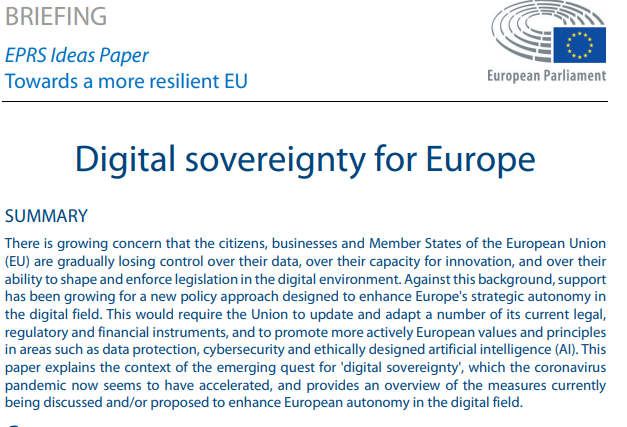
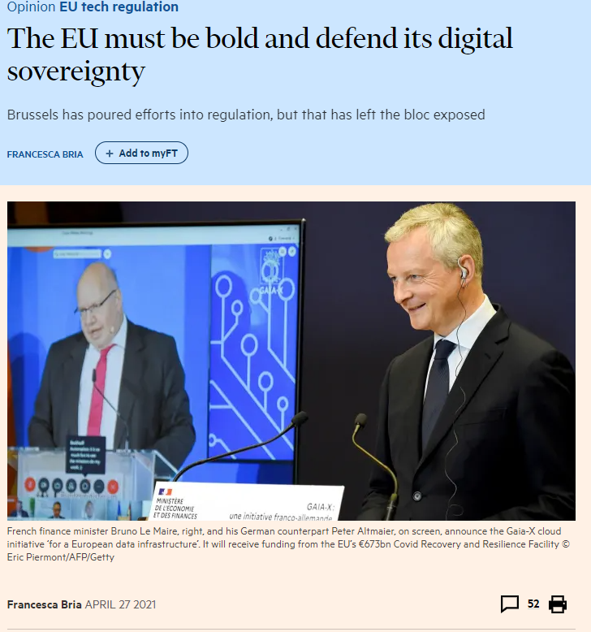
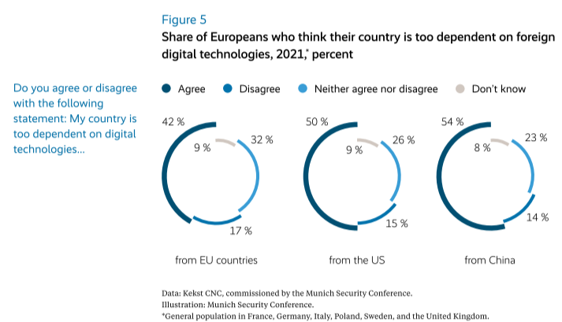
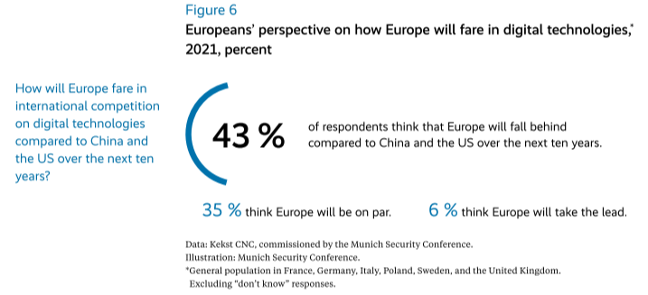
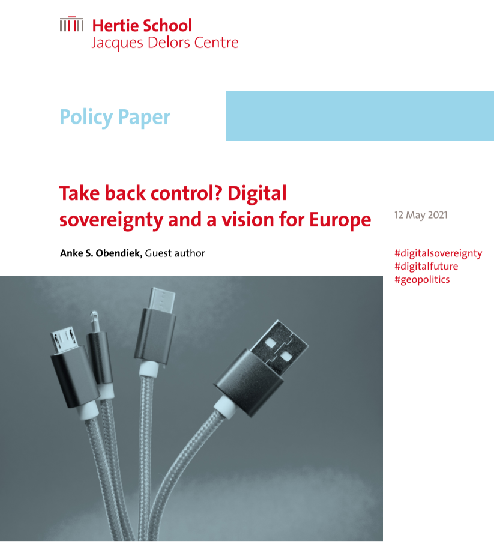

---
output:
  xaringan::moon_reader:
    includes:
      after_body: insert-logo.Rhtml
    lib_dir: libs
    css: [xaringan-themer.css]
    nature:
      highlightStyle: github
      highlightLines: true
      countIncrementalSlides: false
      ratio: "16:9"
    seal: false
---


```{r setup, include=FALSE}
options(htmltools.dir.version = FALSE, crayon.enabled = TRUE, htmltools.preserve.raw = FALSE)

knitr::opts_chunk$set(echo = FALSE, message = FALSE, warning = FALSE, fig.align = 'center')


library(xaringanthemer)
library(crayon)
library(tidyverse)
library(knitr)
library(ggthemes)
library(xts)
library(tidyquant)
library(dygraphs)
library(widgetframe)
library(igraph)
library(networkD3)
library(plotly)
library(ggtext)
library(glue)
library(RColorBrewer)
library(countrycode)
library(cowplot)
library(grid)
library(kableExtra)


```


```{r xaringan-themer}


xaringanthemer::style_mono_light(
  base_color = "#2A363B",
  link_color = "#FF847C",
  text_slide_number_color = "#FECEA8",
  header_font_google = google_font("Lato"),
  text_font_google   = google_font("Roboto"),
  code_font_google   = google_font("IBM Plex Mono"),
  text_font_size = "1.25rem",
  colors = c(
    red = "#f34213",
    purple = "#3e2f5b",
    orange = "#ff8811",
    green = "#99B898",
    white = "#FFFFFF"
  )
)


# colors can be used like this:This ** .red[simple] ** .white.bg - purple[demo]
# _.orange[shows]_ the colors .green[in action].
```


```{r xaringan-tile-view, echo=FALSE}
xaringanExtra::use_tile_view()
```


```{r xaringan-scribble, echo=FALSE}
xaringanExtra::use_scribble(pen_color ="#2A363B")
```

```{r xaringan-editable, echo=FALSE}
xaringanExtra::use_editable(expires = 1)
```

class: inverse, center, middle


# Digital Power Europe

## Spring/Summer Term 2021

<br>

### Anke Obendiek & Timo Seidl

### Centre for European Integration Research


---


name: contents-slide

## Overview

.pull-left[


[Session 1: Introduction](#part1)


#### Part I: Foundations of Digitalization

[Session 2: The Rise of the Platform Society](#part2)

[Session 3: Artifical Intelligence & Big Data](#part3)


#### Part II: The European Union in the World


[Session 4: Normative Power Europe](#part4)


[Session 5: Market Power Europe](#part5)

[Session 6: The Brussels Effect](#part6)

]


.pull-right[


#### Part III: Models of Digitalization

[Session 7: The US: All hail the Market?](#part7)

[Session 8: China: State Surveillance Capitalism?](#part8)

[Session 9: The European Union: A Third Way?](#part9)


#### Part IV: The EU's Digital Agenda

[Session 10: Data Protection](#part10)

[Session 11: Taxation](#part11)

[Session 12: Policy Session: DSA](#part12)
   
]

---


name: part1
class: inverse, center, middle

# Session 1: Introduction: Digital power Europe 

---

## Mobile Tracing Apps and the Sorrows <br> of EU Digital Policy

[Mobile contact tracing apps in EU Member States](https://ec.europa.eu/info/live-work-travel-eu/coronavirus-response/travel-during-coronavirus-pandemic/mobile-contact-tracing-apps-eu-member-states_en)


---
## What kind of digital power is the EU? 

```{r fig.width=16, fig.height=7}
cucumbers <- "img/cucumbers.jpg"
roaming <- "img/roaming.jpg"
papertiger <- "img/papertiger.jpg"
superpower <- "img/superpower.jpg"


eu_df <- data.frame()


p <- eu_df%>%
  ggplot()+
  # geom_vline(aes(xintercept = 0, color = "red"))+
  # # geom_hline(yintercept = 0)+
  theme_void()+
  theme(plot.background = element_rect(fill = "#E9EAEB"))


ggdraw(p)+
  draw_image(cucumbers, scale = 0.15, hjust = 0.425)+
  draw_image(roaming, scale = 0.15, hjust = -0.42)+
  draw_image(papertiger, scale = 0.15, vjust = 0.42)+
  draw_image(superpower, scale = 0.15, vjust = -0.42)+
  annotation_custom(grobTree(textGrob("Bureaucratic nuisance",  hjust=1.35, vjust = 7,
                                      gp=gpar(col="#2A363B", fontsize=25, fontface="italic"))))+
  annotation_custom(grobTree(textGrob("Benign but in decline",  hjust=-.55, vjust = 7,
                                      gp=gpar(col="#2A363B", fontsize=25, fontface="italic"))))+
  annotation_custom(grobTree(textGrob("Totalitarian superstate",  hjust=1.4, vjust = -6,
                                      gp=gpar(col="#2A363B", fontsize=25, fontface="italic"))))+
  annotation_custom(grobTree(textGrob("'Brussels Effect'",  hjust=-.75, vjust = -6,
                                      gp=gpar(col="#2A363B", fontsize=25, fontface="italic"))))
```
---
## Where should we go from here?


.pull-left[

```{r out.width= "35%", hjust = 5.5}

knitr::include_graphics("https://www.handelsblatt.com/images/ursula-von-der-leyen-bei-der-vorstellung-ihres-teams/25009826/5-format2020.jpg")

```

<br>

"But Europe must now lead the way on digital – or it will have to follow the way of others, who are setting these standards for us. This is why we must move fast." (2020)
]


.pull-right[


```{r out.width= "25%", hjust = 2.5}

knitr::include_graphics("https://www.wilmerhale.com/-/media/images/people/barshefsky_charlene.jpg?h=760&w=760&la=en&hash=905D332C340F253FCE2E618FE0C3A091")

```

"Over recent months, EU leaders have unveiled an ambitious agenda aimed at limiting US technology under the banner of securing European “digital sovereignty”. This incipient techno-nationalism threatens both US and European interests and must be stopped."(2020)
]


---
##Introduction round 

<br>

- What's your name?
 
- What do you study?
 
- What aspect of digital power Europe are you particularly interested in?
 
- Which platform/service by tech giants do you feel most conflicted about using – but use anyway?

---
## Course Policy

<br>

- *Zoom*: Please don't make us speak to a black wall!

- *Response Papers*: Please upload them until 18:00 two days before the seminar (i.e. on Tuesday evening)

- *Grading*: For individual assignments, we use a 15 point scale (with 15 being the highest and 0 being the lowest score), which we'll later convert into your grade. 

- *Feedback*: If you want more extensive feedback on any of your assignments, just reach out to us!

---
## Requirements
Students are required to attend classes and come prepared (i.e., having finished and thought about the readings). In addition, there will be three types of assignments that together make up the final grade.

-	First, for three sessions of their choosing, students need to write short response papers (half a page) that reflect on the readings and end with a question for the class (25%). And remember, questions end with a question mark.

-	Second, they are required to deliver a very short input presentation (around 5-10 minutes) for one session as well as prepare discussion points for the class (e.g., questions, empirical examples) (25%). The former is meant to quickly summarize the main points of the reading(s) and the latter is meant to kick off and organize the discussion.

-	Lastly, students need to write a relatively short term paper on a topic related to the course (up to 4000 words) (50%). The paper can be theoretical or empirical and is meant to hone in on one particular question that the students can pick themselves (although they should briefly discuss this with us in advance).


---


name: part2
class: inverse, center, middle

# Session 2: The Rise of the Platform Society


---
class: inverse, center, middle

# Exercise I

<br>


### What makes a platform a platform? What are (positive or negative) characteristics that the term suggests? 

---

## A Definition & A Provokation


<br>

<br>

>Platforms as "digital services that facilitate interactions via the internet between two or more distinct but interdependent sets of users (whether firms or individuals)." <br> &mdash; Gawer & Srnicek 2021, p.1


<br><br>


> "Competition is for Losers." <br> &mdash; Peter Thiel


---
class: inverse, center, middle


# Exercise II

<br>


### What are the challenges for regulation and governance that emerge in the platform society? Write down one major challenge in the tool and share with the group! 


---


name: part3
class: inverse, center, middle

# Session 3: Artifical Intelligence & Big Data

---


## Capitalism without (Physical) Capital

.pull-left[


```{r out.width= "125%", fig.align="center"}

#use frameablewidget instead of framewidget (for better embedding and also for pdf printing)

widgetframe::frameableWidget(DiagrammeR::grViz("

graph{

graph[layout = circo, rankdir=RL]

node[shape = plaintext, fontname = Helvetica, fontcolor = '#2A363B', fontsize = 35]


'A'[label= Buildings]
'B'[label= 'ICT Equipment']
'C'[label= 'Noncomputer machinery']
'D'[label= Vehicles]
'E'[label= Databases, fontcolor = '#8B0000', color = '#8B0000', fontsize = 55, shape = box, penwidth = 4]
'F'[label= Software]
'G'[label= 'Business processes']
'H'[label= 'Organizational culture']
'I'[label= Designs]
'J'[label= 'Firm-Specific Human Capital']
'K'[label= 'Intellectual property']

'M'[label = 'Tangible Assets', shape = circle, style = filled, fillcolor = '#add8e6']
'N'[label = 'Intangible Assets', shape = circle, style = filled, fillcolor = '#CBC3E3' ]
        
edge[color = '#2A363B']


'A' -- 'M'
'B' -- 'M'
'C' -- 'M'
'D' -- 'M'
'E' -- 'N'[style = bold, color = '#8B0000']
'F' -- 'N'
'G' -- 'N'
'H' -- 'N'
'I' -- 'N'
'J' -- 'N'
'K' -- 'N'

}

"))
```


]

.pull-right[

<br>

```{r out.width="45%", fig.align='right'}
knitr::include_graphics("https://images-na.ssl-images-amazon.com/images/I/61DeBIJn5wL.jpg")
```


]

---


## Big-Data Mindsets

.pull-left[

<br>

> For many of today's sucessful companies, "the data and the know-how are not the main reasons for their success. What sets them apart is that their founders and employees have unique ideas about ways to tap data to unlock new forms of value. [This is what we call a] big-data mindset. " <br>	&mdash; Mayer-Schönberger & Cuckier 2013

]

.pull-right[

<br>

```{r out.width="43%"}
knitr::include_graphics("https://diariodenoor.files.wordpress.com/2014/05/big-data_book-cukier.jpg")
```

]

---

class:inverse, center, middle

# Exercise I

<br>

### What characterises a big-data mindset? Read the case study on *Decide.com* and identify core characteristics.


---

## Case Study: *Decide.com*

<br>

<font size="4.9"> 

IN 2011 A CLEVER STARTUP in Seattle called Decide.com opened its online doors with fantastically bold ambitions. It wanted to be a price-prediction engine for zillions of consumer products. But it planned to start relatively modestly: with every possible tech gadget, from mobile phones and flat-screen televisions to digital cameras. Its computers sucked down data feeds from e-commerce sites and scoured the Web for any other price and product information they could find.

Prices on the Web constantly change throughout the day, dynamically updating based on countless, intricate factors. So the company needed to collect pricing data at all times. It isn’t just big data but “big text” too, since the system had to analyze words to recognize when a product was being discontinued or a newer model was about to launch, information that consumers ought to know and that affects prices.

A year later, Decide.com was analyzing four million products using over 25 billion price observations. It identified oddities about retailing that people had never been able to “see” before, like the fact that prices might temporarily increase for older models once new ones are introduced. Most people would purchase the older one figuring it would be cheaper, but depending on when they clicked “buy,” they might pay more. As online stores increasingly use automated pricing systems, Decide.com can spot unnatural, algorithmic price spikes and warn consumers to wait. The company’s predictions, according to its internal measurements, are accurate 77 percent of the time and provide buyers with average potential savings of around $100 per product. So confident is the company, that in cases where its predictions prove incorrect, Decide.com will reimburse the price difference to paying members of the service.

<br>
<font size="3">

**Exzerpt from Mayer-Schönberger & Cuckier, Big Data**

---

## Methapors we live by


>“Our ordinary conceptual system, in terms of which we both think and act, is fundamentally metaphorical in nature. (...) New metaphors are capable of creating new understandings and, therefore, new realities." <br>	&mdash; George Lakoff, Metaphors We Live By

<br>

Data as

- oil

- capital

- water

- a tool

---

class:inverse, center, middle

# Exercise II

<br>

### What do the different methaphors imply for what data is and how it should be treated?

---

## Two Paradoxes of AI

<br>

- **Polanyi's Paradox**: States that humans constantly draw on tacit knowledge that they struggle to articulate and define even to themselves, making it very hard to specify it in computer code.

<br>

<br>

- **Moravec’s Paradox**: States that it is hard for computers to do many tasks that are easy for humans, and conversely, computers can do many things that we find exceedingly difficult.


???

"We know more than we can tell.”

Example: To illustrate Polanyi’s point, it is helpful to contrast the task of repetitive assembly with that of designing a new car, writing a piece of music, or giving a galvanizing speech. The rules for what makes a good song or a great speech are hard to define because there are none.


*Example*: “It is comparatively easy to make computers exhibit adult level performance in solving problems on intelligence tests or playing checkers, and difficult or impossible to give them the skills
of a one- year- old when it comes to perception and mobility."


---


## Three Observations by the MIT <br> Work of the Future Task Force

<br>

1. Momentous impacts of technological change are unfolding gradually.

2. Rising labor productivity has not translated into broad increases in incomes because labor market institutions and policies have fallen into disrepair.

3. Improving the quality of jobs requires innovation in labor market institutions.


**&rArr; There is time to react, but also the necessity!**

???

Example central power loom, general purpose technology

---


name: part4
class: inverse, center, middle

# Session 4: Normative Power Europe 

---


## Three Faces of Power

.pull-left[

<br>

**Steven Lukes: Power. A Radical View**

<br>

1. Decision-making power

2. Non-decision-making power ('agenda-setting power')

3. Ideological power


]

.pull-right[

<br>

```{r out.width="60%"}
knitr::include_graphics("https://i.pinimg.com/474x/87/7c/31/877c312fa4ee41196c6087ee6f5b1f4f.jpg")
```

]

---


## Powers Compared

<br>

.can-edit[

```{r}
data.frame (
  first_column = c("Great Power",
                   "Civilian Power",
                   "Normative Power"
  ),
  second_column = c("",
                    "",
                    ""),
  third_column = c("",
                   "",
                   "")
)%>%
  rename("Type of Power" = first_column,
         "Means" = second_column,
         "Ends" = third_column)%>%
  kable(booktabs = TRUE, linesep = "\\addlinespace") %>%
  kable_minimal()%>%
  column_spec(1, italic = TRUE)
```
]

---

## Powers Compared

<br>

```{r}
data.frame (
  first_column = c("Great Power",
                   "Civilian Power",
                   "Normative Power"
  ),
  second_column = c("Military (e.g., military coercion, threats)",
                    "Economic (e.g., trade and cooperation agreements, technical and financial assistance, market power)",
                    "Ideational (e.g., cooperation agreements, political dialogue, technical assistance, discourse/narrative, symbolic representations)"),
  third_column = c("Self-Interest",
                   "Self-Interest",
                   "Norm Promotion")
)%>%
  rename("Type of Power" = first_column,
         "Means" = second_column,
         "Ends" = third_column)%>%
  kable(booktabs = TRUE, linesep = "\\addlinespace") %>%
  kable_minimal()%>%
  column_spec(1, italic = TRUE)
```


???

This focuses on how the EU acts and why, not on the effectivness of its action, i.e. the extent to which it actually sucessfully influences norms


---
class: inverse, center, middle

# Exercise I

<br>


### To what extent is Europe a Normative Power? 

### Group 1 and Group 2 make the case that it is, focusing on means and ends respectively. 

### Group 3 and Group 4 make the case against it, again focusing on means and ends respectively.  

---

## Problems with the <br> Normative Power Europe Argument


<br>

- Can we really separate norms and interests that easily?

- Are European values not also contested *within* Europe?

- Is Normative Power Europe a descriptive/explanatory or a normative/critical argument?

- Is it plausible to assume that its history, its nature as a hybrid polity, and its political and legal framework "predisposes it [the EU] to act in a normative way" (Manners 2002, p. 242)?

- How do we deal with the 'performativity' of the theory, i.e., that actors use Normative Power Europe as a discursive tool to create an identity but also an Other?


???

Take EU policy towards the Maghreb, for instance. The insistence on migration control in ENP agreements may well be in the interest of Member States, yet its normative assessment is much more problematic, as there is no undisputed norm in favour of migration. The judgement on this issue will therefore always be essentially a political one, and depend on the analyst’s normative views, however honourable they may be (Diez, 2013)

Also, one could argue for dropping the against one's interest part but retain the shaping what is normal part of the argument in some sort of *strategic constructivism*

---

name: part5
class: inverse, center, middle

# Session 5: Market Power Europe 
---
## Powers Compared

<br>

```{r}
data.frame (
  first_column = c("Great Power",
                   "Civilian Power",
                   "Normative Power"
  ),
  second_column = c("Military (e.g., military coercion, threats)",
                    "Economic (e.g., trade and cooperation agreements, technical and financial assistance, market power)",
                    "Ideational (e.g., cooperation agreements, political dialogue, technical assistance, discourse/narrative, symbolic representations)"),
  third_column = c("Self-Interest",
                   "Self-Interest",
                   "Norm Promotion")
)%>%
  rename("Type of Power" = first_column,
         "Means" = second_column,
         "Ends" = third_column)%>%
  kable(booktabs = TRUE, linesep = "\\addlinespace") %>%
  kable_minimal()%>%
  column_spec(1, italic = TRUE)
```
---
## Powers Compared

<br>

```{r}
data.frame (
  first_column = c("Great Power",
                   "Civilian Power - EU as a non-military power",
                   "Market Power - EU as a market + institutions + interest groups",
                   "Normative Power - EU as core norms"
  ),
  second_column = c("Military (e.g., military coercion, threats)",
                    "Civilian (e.g., trade and cooperation agreements, technical and financial assistance)",
                    "Market (e.g., conditionality, membership, extraterritorial regulation)",
                    "Ideational (e.g., cooperation agreements, political dialogue, technical assistance, discourse/narrative, symbolic representations)"),
  third_column = c("Self-Interest",
                   "Self-Interest",
                   "Self-Interest",
                   "Norm Promotion")
)%>%
  rename("Type of Power" = first_column,
         "Means" = second_column,
         "Ends" = third_column)%>%
  kable(booktabs = TRUE, linesep = "\\addlinespace") %>%
  kable_minimal()%>%
  column_spec(1, italic = TRUE)
```
---
class: inverse, center, middle

Annotate the resolution of the European Parliament: What constructions of EU power can you identify? Try to differentiate in the comments between means and ends. https://moodle.univie.ac.at/mod/pdfannotator/view.php?id=8856467 
---
###Potential applications of AI in military operations
<br>
- Intelligence and surveillance, forecasting

- Logistics (predictive maintenance, efficient shipping, and autonomous transport systems)

- Cyber operations (both defensive and offensive)

- Semi-autonomous and autonomous vehicles and weapons (including lethal autonomous weapons systems (LAWS)

- Swarming, ie. the coordination of many units working together

- Training (e.g. through war games and simulations)

.footnote[Source: Franke (2019) https://ecfr.eu/publication/not_smart_enough_poverty_european_military_thinking_artificial_intelligence/]

--- 


---

name: part6
class: inverse, center, middle

# Session 6: The Brussels Effect


---


## The Brussels Effect: Conceptual Framework


```{r out.width= "100%", fig.align="center"}

#use frameablewidget instead of framewidget (for better embedding and also for pdf printing)

widgetframe::frameableWidget(DiagrammeR::grViz("

digraph{

graph[layout = dot]

node[shape = plaintext, fontname = Helvetica, fontcolor = '#2A363B', fontsize = 35]


'A'[label= 'Market Size', fontcolor = '#accbff']
'B'[label= 'Capacity of Regulator' , fontcolor = '#92bbff']
'B2'[label= 'x']
'C'[label= 'Stringency of Rules', fontcolor = '#78aaff']
'C2'[label= 'x']
'D'[label= 'Elasticity of Targets', fontcolor = '#649eff']
'D2'[label= 'x']
'E'[label= 'Non-Divisability of Targets', fontcolor = '#4188ff']
'E2'[label= 'x']
'F'[label= 'Brussels Effect', fontcolor = violet]
'F2'[label= 'x']

        
edge[color = '#2A363B']


'A' -> 'B'[label = 'large', color = '#accbff', fontcolor = '#accbff']
'A' -> 'B2'[label = 'small']
'B' -> 'C'[label = 'high', color = '#92bbff', fontcolor = '#92bbff']
'B' -> 'C2'[label = 'low']
'C' -> 'D'[label = 'high', color = '#78aaff', fontcolor = '#78aaff']
'C' -> 'D2'[label = 'low']
'D' -> 'E'[label = 'low', color = '#649eff', fontcolor = '#649eff']
'D' -> 'E2'[label = 'high']
'E' -> 'F'[label = 'high', color = '#4188ff', fontcolor = '#4188ff']
'E' -> 'F2'[label = 'low']

}

"))
```


---


## Charger Chaos


```{r  out.width="60%"}

knitr::include_graphics("https://thumbs.dreamstime.com/b/charging-phones-other-devices-mess-lots-chargers-tangled-crowded-corner-181543054.jpg")


```


---


## Is the first course over?


.pull-left[


```{r out.width="60%"}

knitr::include_graphics("https://image.gala.de/20549588/t/hB/v16/w480/r1/-/liam-gallagher-ge--10599364-.jpg")


```


]

--


.pull-right[

<br>
<br>

> “He's like a man with a fork, in a world of soup. (about his brother Liam)” <br> &mdash; Noel Gallagher

]

---


class: inverse, center, middle

# Exercise I

<br>


### Is the 'soup stage' of globalization ending, and, if so, does the EU need the fork of industrial policy or the knife of geo-economic assertiveness in addition to the spoon of its market power to make sure European interests and values are represented on the global stage?

---


class: inverse, center, middle

# Exercise II

<br>


### What are the normative implications of the Brussels Effect (BE)? Group 1 and Group 2: Think about normatively problematic dimensions of the BE. Group 3 and Group 4: Think about normatively desirable dimensions of the BE.

---
name: part7
class: inverse, center, middle

# Session 7: All hail the market? 

---
class: inverse, center, middle

##What can we learn from Bach and Newman’s (2004) conception of carrot and stick capacity concerning the framework for global electronic commerce? 
---
class: inverse, center, middle

##What has changed since then, and what can we learn about self-regulation from Farrell and Newman's (2021) paper? 
---
##Seminar papers
1.	Draw a mind map of interesting topics and illustrate potential links to the idea of Digital Power Europe. Think about specific topics/links that you find particularly interesting and **write down three questions**. (5 mins) 

2.	Breakout rooms: Briefly explain your topic and points of interest to your group. 

3.	As a group, assign a discussant for each topic. 

4.	As a discussant, write down **one reason** why your partner’s topic and questions are **relevant**, pose **one question** you have about the potential paper (e.g. which data/method/theory/alternative approaches), and make at least **one suggestion** to **improve/specify** the question.  

5.	Present and discuss in the group. 

---
name: part8 
class: inverse, center, middle

#Session 8: China: State Surveillance Capitalism?

---
class: inverse, center, middle

##How can we conceptualize key features of the US (Group 1 and 2) vs. the Chinese (Group 3 and 4) approach? Write in the shared Etherpad. 
---

## Approaches compared

<br>

.can-edit[

```{r}
data.frame (
  first_column = c("US",
                   "China"
                   
  ),
  second_column = c("",
                    ""),
  third_column = c("",
                   ""),
  fourth_column = c("",
                   "")
)%>%
  rename("Model" = first_column,
         "Key players/institutions" = second_column,
         "Norms/interests" = third_column, 
         "Power" = fourth_column)%>%
  kable(booktabs = TRUE, linesep = "\\addlinespace") %>%
  kable_minimal()%>%
  column_spec(1, italic = TRUE)
```
]

---
#### Executive Order on Addressing the Threat Posed by TikTok

"I, DONALD J. TRUMP, President of the United States of America, find that additional steps must be taken to deal with **the national emergency** with respect to the information and communications technology and services supply chain declared in Executive Order 13873 of May 15, 2019 (Securing the Information and Communications Technology and Services Supply Chain). Specifically, the **spread in the United States of mobile applications developed and owned by companies in the People’s Republic of China (China)** continues to threaten the national security, foreign policy, and economy of the United States.  At this time, action must be taken to address the threat posed by one mobile application in particular, TikTok.

**TikTok**, a video-sharing mobile application owned by the Chinese company ByteDance Ltd., has reportedly been downloaded over 175 million times in the United States and over one billion times globally. TikTok automatically captures vast swaths of information from its users, including Internet and other network activity information such as location data and browsing and search histories. This data collection **threatens to allow the Chinese Communist Party access to Americans’ personal and proprietary information** — potentially allowing China to track the locations of Federal employees and contractors, build dossiers of personal information for blackmail, and conduct corporate espionage."
---
class: inverse, center, middle
##Afraid of the Beijing effect? 

###Should we adopt a geopolitical approach to digital governance?

###Find pro (Group 1 and 2) and con (Group 3 and 4) arguments, also drawing on the examples of Huawei and TikTok. 


---
name: part9
class: inverse, center, middle

#Session 9: The European Union: A Third Way?

---

## Digital Sovereignty I


.pull-left[


```{r out.width="80%"}




```


]


.pull-right[

```{r out.width="70%"}




```

]


---

## Digital Sovereignty II


.pull-left[


```{r out.width="90%"}




```

]


.pull-right[

```{r out.width="90%"}




```
]

---

## Digital Sovereignty III


.pull-left[

<br>


> "The concept [of digital sovereignty] still lacks clarity and, to some extent, purpose. (...) The frequent invocation of this buzzword risks glossing over the fact that the EU still lacks a concrete idea of what it wants rather than just what it fears."

]


.pull-right[

```{r out.width="70%"}




```
]

---

class: inverse, center, middle

# Exercise

<br>


### You're invited to write a chapter for the International Encyclopedia of Political Concepts. Your task is to define the concept of digital sovereignty. Before writing the article, the editor asks you to briefly define the concept in three bullet points. These can contain different dimensions or competing intepretations of digital sovereignty.

---

name: part10
class: inverse, center, middle

#Session 10: Data Protection

---
class: inverse, center, middle

```{r out.width= '120%'}
knitr::include_graphics("img/Beyonce.png")
```

---
## The GDPR

####•	the ‘right to be forgotten’, 
####•	data portability, protection by design and default 
####•	increased transparency for privacy policies and data breaches/hacking
####•	the right to object to profiling;
####•	stronger enforcement and fines of up to 4 % of firms’ total annual turnover
####•	marketplace principle

---
## EU vs. US


<br>

> "If before the revelations the GDPR debate was solely about Internet privacy,
now it had become about the protection of Europeans’ Internet privacy from unwanted
and abusive American surveillance." (Rossi 2018, 106)
---

##Schrems II - the judgement

"In the view of the Court, the limitations on the **protection of personal data** arising from the domestic law of the United States on the access and use by US public authorities of such data transferred from the European Union to that third country, which the Commission assessed in Decision 2016/1250, **are not circumscribed in a way that satisfies requirements that are essentially equivalent to those required under EU law**, by the principle of proportionality, in so far as **the surveillance programmes based on those provisions are not limited to what is strictly necessary**" (CJEU, 2020, p. 3, emphasis in original)

---
##US Department of Commerce
1. Most U.S. companies **do not deal in data that is of any interest to U.S. intelligence agencies**, and have no grounds to believe they do. They are not engaged in data transfers that present the type of risks to privacy that appear to have concerned the ECJ in Schrems II. 

2. The U.S. government **frequently shares intelligence information with EU Member States**, including data disclosed by companies in response to FISA 702 orders, to counter threats such as terrorism, weapons proliferation, and hostile foreign cyber activity. Sharing of FISA 702 information undoubtedly serves important EU public interests by protecting the governments and people of the Member States. 

3. There is a **wealth of public information about privacy protections** in U.S. law concerning government access to data for national security purposes, including information not recorded in Decision 2016/1250, new developments that have occurred since 2016, and information the **ECJ neither considered nor addressed**. Companies may wish to take this information into account in any assessment of U.S. law post-Schrems II. 
---
##Schrems II - the negotiations

“The U.S. Government and the European Commission have decided to **intensify negotiations** on an enhanced EU-U.S. Privacy Shield framework to comply with the July 16, 2020 judgment of the Court of Justice of the European Union in the Schrems II case.

These negotiations underscore our **shared commitment to privacy, data protection and the rule of law** and our mutual recognition of the importance of transatlantic data flows to our respective citizens, economies, and societies.

Our **partnership on facilitating trusted data flows** will support economic recovery after the global pandemic, to the benefit of citizens and businesses on both sides of the Atlantic.” 

.footnote[https://ec.europa.eu/commission/presscorner/detail/en/STATEMENT_21_1443]


---
class: inverse, center, middle

# Exercise

<br>

####Why is the transatlantic relationship so difficult when it comes to data governance? Imagine you are tasked with the negotiation of a new deal – what interests, norms, and stakeholders do you have to consider and what would you propose as potential solutions…

####•	as the European Commission? (Groups 1 and 2)

####•	as the US negotiating team from the Department of Commerce? (Groups 3 and 4)


---

name: part11
class: inverse, center, middle

#Session 11: Taxation


---


class: inverse, center, middle

## Exercise


#### You are a EU policymaker and want to introduce a digital tax. Think about and justify such a tax based on one of the following principles. 

##### Group 1: Proportionality | Idea: The rich/powerful should pay higher taxes | Analogues: Progressive wealth/income taxes

##### Group 2: Externality | Idea: External costs of economic transactions should be internalized through the tax system | Analogues: Tabacco taxes, carbon pricing

##### Group 3: Fairness | Idea: Everyone should pay the same; there should be a level playing field | Analogues: Anti-tax-arbitrage legislation


#### Write a short (ca. 150 words) press release where you explain what your policy, i.e., the rough design of your tax and why it is the right policy (e.g., we tax this specific digital activity and not all because we think it's particularly harmful). 


---

name: part12
class: inverse, center, middle

#Session 12: Policy Session: DSA with Julian Jaursch


