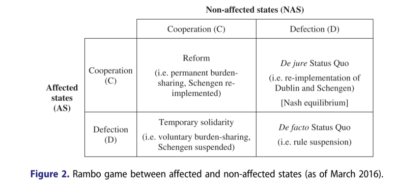

---
output:
  xaringan::moon_reader:
    includes:
      after_body: insert-logo.Rhtml
    lib_dir: libs
    css: [xaringan-themer.css]
    nature:
      highlightStyle: github
      highlightLines: true
      countIncrementalSlides: false
      ratio: "16:9"
    seal: false
---


```{r setup, include=FALSE}
options(htmltools.dir.version = FALSE, crayon.enabled = TRUE, htmltools.preserve.raw = FALSE)

knitr::opts_chunk$set(echo = FALSE, message = FALSE, warning = FALSE, fig.align='center')


library(xaringanthemer)
library(crayon)
library(tidyverse)
library(knitr)
library(ggthemes)
library(kableExtra)
library(xts)
library(tidyquant)
library(dygraphs)
library(widgetframe)
library(rDNA)
library(igraph)
library(networkD3)
library(plotly)
library(ggtext)
library(glue)
library(OECD)
library(RColorBrewer)
library(countrycode)
library(cowplot)
library(grid)
library(directlabels)


```


```{r xaringan-themer}


xaringanthemer::style_mono_light(
  base_color = "#2A363B",
  link_color = "#FF847C",
  text_slide_number_color = "#FECEA8",
  header_font_google = google_font("Lato"),
  text_font_google   = google_font("Roboto"),
  code_font_google   = google_font("IBM Plex Mono"),
  text_font_size = "1.25rem",
  colors = c(
    red = "#f34213",
    purple = "#3e2f5b",
    orange = "#ff8811",
    green = "#99B898",
    white = "#FFFFFF"
  )
)


# colors can be used like this:This ** .red[simple] ** .white.bg - purple[demo]
# _.orange[shows]_ the colors .green[in action].
```


```{r xaringan-tile-view, echo=FALSE}
xaringanExtra::use_tile_view()
```


```{r xaringan-scribble, echo=FALSE}
xaringanExtra::use_scribble(pen_color ="#2A363B")
```


```{r xaringan-editable, echo=FALSE}
xaringanExtra::use_editable(expires = 1)
```

class: inverse, center, middle


# Policymaking in the European Union

## Spring/Summer Term 2021

<br>

### Timo Seidl

### Centre for European Integration Research

---


name: contents-slide

## Overview

.pull-left[


[Session 1: Introduction](#part1)

#### Part I: Theories of European Integration

[Session 2: Neofunctionalism](#part2)

[Session 3: Intergovernmentalism](#part3)

[Session 4: Postfunctionalism](#part4)

#### Part II: The European Union as a Polity


[Session 5: An Institutional Anatomy of the EU](#part5)

[Session 6: Interest Groups in the EU](#part6)

]


.pull-right[


[Session 7: Agenda-Setting and Policy-Formulation](#part7)

[Session 8: Decision-Making](#part8)

[Session 9: Implementation](#part9)


#### Part III: Selected Policy Areas

[Session 10: Competition Policy](#part10)

[Session 11: Trade Policy](#part11)

[Session 12 Digital Policy](#part12)
   
]


---


name: part1
class: inverse, center, middle

# Session 1: Introduction

.footnote[

[Back to the contents slide](#contents-slide)

]

---

## Narratives on the European Union

```{r fig.width=16, fig.height=7}

cucumbers <- "img/cucumbers.jpg"
roaming <- "img/roaming.jpg"
papertiger <- "img/papertiger.jpg"
superpower <- "img/superpower.jpg"


eu_df <- data.frame()


p <- eu_df%>%
  ggplot()+
  # geom_vline(aes(xintercept = 0, color = "red"))+
  # # geom_hline(yintercept = 0)+
  theme_void()+
  theme(plot.background = element_rect(fill = "#E9EAEB"))


ggdraw(p)+
  draw_image(cucumbers, scale = 0.15, hjust = 0.425)+
  draw_image(roaming, scale = 0.15, hjust = -0.42)+
  draw_image(papertiger, scale = 0.15, vjust = 0.42)+
  draw_image(superpower, scale = 0.15, vjust = -0.42)+
  annotation_custom(grobTree(textGrob("Bureaucratic nuisance",  hjust=1.35, vjust = 7,
                                      gp=gpar(col="#2A363B", fontsize=25, fontface="italic"))))+
  annotation_custom(grobTree(textGrob("Benign but in decline",  hjust=-.55, vjust = 7,
                                      gp=gpar(col="#2A363B", fontsize=25, fontface="italic"))))+
  annotation_custom(grobTree(textGrob("Totalitarian superstate",  hjust=1.4, vjust = -6,
                                      gp=gpar(col="#2A363B", fontsize=25, fontface="italic"))))+
  annotation_custom(grobTree(textGrob("'Brussels Effect'",  hjust=-.75, vjust = -6,
                                      gp=gpar(col="#2A363B", fontsize=25, fontface="italic"))))
```


???

Paper tiger-superhero dimension:  
  - ineffectual vs overpowered
  
cucumber-roaming dimension:
  - unresponsive, removed bureaucrats vs. sensible policymakers


General consensus that EU policies matter, from large (economic rules, privacy rights) to small (color of passports, labeling of potato crisps)


---

## About this Course

 
<br>

- EU policies matter, but how can we explain them?

> This course is about understanding "the processes that produce EU policies; that is, the decision (or non-decisions) by EU public authorities facing choices between alternative courses of public action" (Wallace et al. 2020, p. 6-7).

<br>

- This course is divided into **three** parts:

  - Theories of European integration (*EU as a process*)
  - Theories of EU policymaking (*EU as a polity*)
  - Case studies on specific policy areas


???

EU Integration theories: 

  - from IR, causes and direction of EU integration as a process, is it driven by member states or supranational actors?


Theories of EU policymaking: 

  - from comparative politics: treat EU as a political system, akin to domestic political systems
  

---

## The 'Polycrisis' & Integration Theories


.pull-left[


```{r out.width='90%', fig.align='center'}

knitr::include_graphics("img/polycrisis.jpg")
```

]


.pull-right[

<br>


```{r out.width='100%', fig.align='center'}

knitr::include_graphics("img/elephant.jpeg")
```


]

???

Two arguments:

- Europe forged in crisis, crises pivotal moments in European integration and therefore also for European integration theory, who are the important actors, what drives integration or disintegration?
Foil against which we will look at these theories

- Integration theories are partial, focus on specific things


---

## Institutional Landscapes & Policy Cycles


.pull-left[


```{r out.width= "85%", fig.align="center"}

#use frameablewidget instead of framewidget (for better embedding and also for pdf printing)

widgetframe::frameableWidget(DiagrammeR::grViz("

graph{

graph[layout = circo, rankdir = BT, fontsize = 35]

node[shape = box, fontname = Helvetica, fontcolor = '#2A363B']


'European Parliament'[label=<European Parliament<BR />
        <FONT POINT-SIZE='10'>'Voice of the People'</FONT>>]
'Council of the European Union' [label=<Council of the European Union<BR />
        <FONT POINT-SIZE='10'>'Voice of the Member States'</FONT>>]
'European Commission' [label=<European Commission<BR />
        <FONT POINT-SIZE='10'>'Promoting the Common Interest'</FONT>>]
        
'Interest Groups (firms, trade unions, NGOs)'

'Other EU Institutions (e.g., ECB, ECJ, WP29)'


edge[color = '#2A363B']


'European Parliament' -- 'Council of the European Union'
'European Commission' -- 'Council of the European Union'
'European Commission' -- 'European Parliament'
}

"))
```

]


.pull-right[


```{r out.width= "85%", fig.align="center"}

#use frameablewidget instead of framewidget (for better embedding and also for pdf printing)

widgetframe::frameableWidget(DiagrammeR::grViz("
digraph {

  # a 'graph' statement
  graph [overlap = false, fontsize = 35, layout = circo, rankdir = RL]

  # several 'node' statements


  node[shape = plaintext, fontname = Helvetica, fontcolor = '#2A363B']

 'Implementation (Session 9)'
        
  'Feedback' 
        
  'Agenda Setting (Session 7)' 

 'Policy Formulation (Session 7)'
        
 'Decision Making (Session 8)' 
        
  # several 'edge' statements

  edge[arrowhead = normal, minlen=15, color = '#2A363B']
  
  'Feedback'  -> 'Agenda Setting (Session 7)' 
  'Agenda Setting (Session 7)'  -> 'Policy Formulation (Session 7)'
  'Policy Formulation (Session 7)' -> 'Decision Making (Session 8)'
 'Decision Making (Session 8)'  ->  'Implementation (Session 9)'
   'Implementation (Session 9)' -> 'Feedback'

}
"))
```


]

???

"institutional triangle", but also other actors


Policy cycles as an analytic instrument rather than a causal theory

Agenda-Setting:

  - Deciding what to decide as crucial part of policymaking
  

Policy-Formulation:

  - formulation of policy alternatives
  
Decision-Making:

Who decides? (Delegation/Executive Decision-making vs. legislative politics (normal in EP, bargaining in council, inter-institutional?))

Implementation:

vague language, directives, political will


Feedback:

evaluations of effectiveness, political feedback loops (path-dependencies), spill-over (e.g. elimination of border controls requires cross-border cooperation in policing)

---

## About Me & About You

.pull-left[

What did I do before?

- I got my PhD from the European University Institute in Florence

- My thesis is on the comparative political economy of digital capitalism


What do I do now?

- I am a post-doc (Universitätsassistent) at the [Centre for European Integration Research (EIF)](https://eif.univie.ac.at/) at the University of Vienna

- I work on the EU's role in the digital transformation


]

.pull-right[


What about you?

- What's your name?

- What do you study?

- Why did you pick this course?

- What is your favorite smell?


]


---

## Course Policy

<br>

- *Zoom*: Please don't make me speak to a black wall!

- *Response Papers*: Please upload them until 18:00 two days before the seminar (i.e. on Tuesday evening)

- *Grading*: For individual assignments, I use a 15 point scale (with 15 being the highest and 0 being the lowest score), which I'll later convert into your grade. 

- *Feedback*: If you want more extensive feedback on any of your assignments, just reach out to me!


---


class: hide-logo

<object data="https://www.timoseidl.com/courses/policymaking-in-the-european-union/Syllabus_Policymaking-in-the-European-Union.pdf" type="application/pdf" width="1000px" height="600px">
    <embed src="https://www.timoseidl.com/courses/policymaking-in-the-european-union/Syllabus_Policymaking-in-the-European-Union.pdf">
        <p>This browser does not support PDFs. Please download the PDF to view it: <a href="https://www.timoseidl.com/courses/policymaking-in-the-european-union/Syllabus_Policymaking-in-the-European-Union.pdf">Download PDF</a>.</p>
    </embed>
</object>

---


name: part2
class: inverse, center, middle

# Session 2: Neo-Functionalism

.footnote[

[Back to the contents slide](#contents-slide)

]


---

## What is Neo-Functionalism?

> "Neo-functionalism is a theory of market and political integration within a specific region constituted by those states that have taken a formal decision to integrate" (Sandholtz & Stone Sweet 2012, p. 19). Specifically, it asks, "whether and how economic integration leads to political integration." (Jensen, 2019, p. 58).


Neo-Functionalism posits a 

- **broadening** and **deepening** supranational competences

- **three** main mechanisms of this supranationalizaiton of competences:

    - Spillover
    - Elite Socialization
    - Formation of supranational interest groups
    
The supranational governance approach directly builds on this, but focuses more on transnational exchange, EU rules, and supranational institutions.


???

Schimmelfennig 2014: What unites the different versions of neofunctionalism is the idea of a dynamic and progressive integration process that transcends its intergovernmental origins as a result of endogenous interdependencies, spillovers and path-dependencies."

Difference supranational governance: 

The supranational governance approach "emphasizes the role of transnational exchange, EU rules, and supranational institutions. They argue that cross-border transactions generate a demand for Community rules, which EC institutions seek to supply. Once Community legislation develops, supranational society emerges as (business) actors realize that one set of rules is preferable to numerous sets of (national)
rules." (Niemann 2015)

However, in his revised theory Schmitter rejects the “automaticity of spillover” assumption. Strategic responses other than spillover are conceptualized, such as (a) “spill-around,” the proliferation of functionally specialized independent, but strictly intergovernmental, institutions; (b) “build-up,” the concession by Member States of greater authority to the supranational organization without expanding the scope of its mandate; (c) and (d) “spill-back,” which denotes withdrawal from previous commitments by member states.

---

## Example: Judicial Activism

<br>

.pull-left[


*Dassonville* (C-8/74, 11 July 1974) & *Cassis de Dijon* (C-120/78, 20 February 1979)

  - Expansive interpretation of the law: from non-discrimination to non-restriction
  - Principle of mutual recognition: goods lawfully sold in one member state can also be sold in any other EU country

]

.pull-right[

```{r out.width="40%", fig.align='center'}
knitr::include_graphics("https://upload.wikimedia.org/wikipedia/commons/e/eb/Creme_de_Cassis.jpg")
```

]
  
???

Initially, the “four freedoms”—the free movement of goods, capital, services, and persons—aimed at guaranteeing discrimination-free transnational access to the member states’ markets. Since its pathbreaking Dassonville and Cassis de Dijon decisions, however, the ECJ has replaced the principle of nondiscrimination by the principle of nonrestriction. According to the nonrestriction principle, every national regulation that restricts the transnational exercise of one of the four freedoms is in potential violation of European law, even if the regulation is discrimination-free, that is, imposed equally on nationals and nonnationals alike. This reinterpretation has far-reaching implications for the scope of market-enforcing integration. Interpreted as individual rights for restriction-free market action, the four freedoms can now be used not merely to eliminate disguised protectionism on the part of the member states, but rather to target a wide variety of member states’ political regulations as obstacles to European law. Furthermore, this line of ECJ rulings not only targets political regulation but also—due to the legal doctrine on the horizontal effect of European law—the actions of private bodies such as firms or trade unions.

Rewe, a large German retail company, wanted to import and sell Cassis de Dijon, a crème de cassis blackcurrant liqueur produced in France. The liqueur contained between 15 and 20 per cent alcohol by volume (ABV). Germany, however, had a law specifying that products sold as fruit liqueurs be over 25 per cent ABV. The Bundesmonopolverwaltung für Branntwein (Federal Monopoly Administration for Spirits), part of the Federal Ministry of Finance, informed Rewe that it would not be able to market Cassis in Germany as a liqueur.

---

## Example: The WP29 Working Paper <br> and the GDPR

```{r}
 
data.frame (
  first_column = c(
    "Introduce a new ‘Privacy by Design’ principle (pp. 12-15)",
    "Introduce a new ‘accountability’ principle (p. 20)",
    "Increase data controllers’ responsibilities; introduce data protection impact assessments; reinforce the role of data protection officers (p. 20)",
    "Improve redress mechanisms and introduce class action lawsuits (p. 16)",
    "Improve transparency; introduce data breach notifications (for high risk breaches) (p. 16, 21)",
    "Strengthen consent requirements (p. 17)",
    "Give clear institutional, functional and material independence to the DPAs, as the 1995 directive´s Art. 28 was unclear (pp. 21-22)",
    "Clarify DPA´s enforcement powers, as the 1995 directive’s Art. 28 only contain 3 subparagraphs on enforcement (p. 22)",
    "Extend legislative advisory powers. WP29 opinions should be addressable more actors (e.g. national parliaments) and treat more issues than ‘administrative measures and regulations’ (p.22)",
    "Strengthen the WP29",
    "Ensure more harmonization in an ‘unambiguous and unequivocal legal framework’ (p. 9)"
  ),
  second_column = c("Introduces a new ‘Privacy by Default and by Design’ principle (GDPR Art. 25)",
"Introduces a new ‘accountability’ principle (Art. 5§2)",
"Increases data controllers´ responsibilities; data protection impact assessments are introduced; reinforces the role of data protection officers (GDPR Art. 35-39)",
"Improves redress mechanisms and strengthens the role of public interest groups for the enforcement of rights (GDPR Chapter VIII, particularly Art. 80)",
"Improves transparency; data breach notifications become obligatory (for high risk breaches) (GDPR Section 1 and Art. 34)",
"Strengthens consent requirements (GDPR Art. 7)",
"Strengthens functional (Art. 52§1), institutional (Art. 52§2,5) and material (Art. 52§3,4,6) independence of DPAs",
"Contains 16 subparagraphs on investigative and corrective powers (Art. 58§1,2)",
"Extends the scope of the DPA’s opinions to more actors (e.g. national parliaments) and to ‘any issue related to the protection of personal data’ (Art. 58§3b)",
"Renames WP29 to ‘European Data Protection Board’ with broadened task description (Art. 68 & 70)",
"Directive becomes a regulation")
)%>%
  rename("WP29 Position Paper (2009)" = first_column,
         "GDPR 2016" = second_column )%>%
  kable(booktabs = TRUE, linesep = "\\addlinespace") %>%
  kable_styling(font_size = 12)%>%
  column_spec(1, width = "41em")%>%
  column_spec(2, width = "41em")
```

---

## Task: How well - or poorly - does <br> Neo-Functionalism explain the Euro Crisis?

<br>

- Four Groups

- Group 1 & 2: Arguments in Favor of Neo-Functionalism

- Group 3 & 4: Arguments against Neo-Functionalism

---

## Neo-Functionalism and the Euro Crisis


.pull-left[

**Arguments in Favor of Neo-Functionalism**

- Spillover effects from monetary to fiscal and regulatory integration (Six-Pack, Two-Pack, Banking Union, ESM)

- Business groups overwhelmingly in favor of saving the Euro and more integration

- Important role of EU actors, especially the ECB

- ...

]

.pull-right[

**Arguments not in Favor of Neo-Functionalism**


- Crucial decisions taken by national governments (and the German chancellor and French president in particular)

- 'Summitization' of European crisis responses

- Delegations not to existing supranational institutions such as the Commission but *de novo* bodies (see 'new intergovernmentalism')

- ...

]
---


## Questions 


- From the response papers:

  - Why are there not more "EUs"?

  - Is Neo-Functionalism overly focused on economic factors, downplaying identity concerns?

  - Is Neo-Functionalism to 'elitist', wrongly presupposing the tacit support of the European electorates for the integration efforts of elites. 


- From the presenters:

  - Can neo-functionalism explain why some countries, like Great Britain, never joined the monetary union or the “Schengen-Agreement”?
  
  - Can neo-functionalism be applied outside the European borders?
  
  - How can neo-functionalism be related to nationalism? 


???

Haas was originally interested in formulating a general theory of regional integration. Problem that it needs to be set in motion. Actors need to have sufficient common interests in agreeing to cooperate.


Niemann 2015: Fifth, neofunctionalists assume rational and self-interested actors (Haas 1970: 627), who (nevertheless) have the capacity to learn and change their preferences. Interest-driven national and supranational elites, recognizing the limitations of national solutions, learn from the benefits of regional policies and from their experiences in cooperative decision-making.

Niemann 2015: Fourth, neofunctionalists see the Community primarily as “a creature of elites.” While Haas (1958: chs. 5 and 6) devoted much of his attention to the role of nongovernmental elites, Lindberg (1963: ch. 4) largely focused on governmental elites. Neither ascribed much importance to the role of public opinion. The conclusion was that there was a “permissive consensus” in favor of European integration (Lindberg and Scheingold 1970: 41) and that this would suffice to sustain it.

---

## Any Further Questions?

<iframe src="https://pollev-embeds.com/discourses/gXDSBuPOCuX0kxkmolfp1/respond" width="900px" height="500px"></iframe>


---


name: part3
class: inverse, center, middle

# Session 3: Intergovernmentalism

.footnote[

[Back to the contents slide](#contents-slide)

]


---

## One Grand Theory, Three Smaller Ones

<br>
1. A Liberal Theory of Preference Formation

  - The goals of states are shaped on the domestic level, specifically by dominant, usually economic, groups.

2. A Intergovernmental (Game-)Theory of Bargaining

  - Hard Bargaining often under conditions of asymmetric interdependence.

3. A Theory of Institutional Delegation

  - Institutions are the result of inter-state bargaining and are designed to improve the efficiency of said bargaining, often to ensure credible commitments.
  
???

1. not shaped by the states' perception of their position in the international system. E.g., Moravcik: The vital interest behind de Gaulle's opposition to British membership in the EC was not the pursuit of French grandeur but the price of French wheat. 
---

## Multilevel Preference Formation


```{r out.width= "100%", fig.align="center"}

#use frameablewidget instead of framewidget (for better embedding and also for pdf printing)

widgetframe::frameableWidget(DiagrammeR::grViz("

digraph{

graph[ rankdir =LR, fontsize = 35]

node[shape = box, fontname = Helvetica, fontcolor = '#2A363B']


'A1'[ width = 2.8,label='Business Groups']
'A2'[width = 2.8,label='Trade Unions']
'A3'[width = 2.8,label='NGOs']

'B'[width = 2.8,label=<Regional Bodies<BR />
        <FONT POINT-SIZE='10'>(e.g., Governors)</FONT>>]
'C'[width = 2.8,label=<Local Bodies<BR />
        <FONT POINT-SIZE='10'>(e.g., Mayors)</FONT>>]
'D'[width = 2.8, label=<Supranational Bodies<BR />
        <FONT POINT-SIZE='10'>(e.g., Commission)</FONT>>]
'E'[width = 2.8, label=<Federal Bodies<BR />
        <FONT POINT-SIZE='10'>(e.g., federal ministries)</FONT>>]
'H'[shape = triangle,width = 5,label='Regional Level']
'I'[shape = triangle,width = 5,label='Local Level']
'F'[shape = triangle, width = 5,label='Supranational Level']
'G'[shape = triangle,width = 5,label='National Level']


edge[color = '#2A363B']


'A1' -> 'F'
'A2' -> 'F'
'A3' -> 'F'
'A1' -> 'G'
'A2' -> 'G'
'A3' -> 'G'
'A1' -> 'H'
'A2' -> 'H'
'A3' -> 'H'
'A1' -> 'I'
'A2' -> 'I'
'A3' -> 'I'


#here reverse arrow direction for positioning

F->{'B' 'C', 'D', 'E'}[dir = 'back']
G->'B'[dir = 'back']
G->'C'[dir = 'back']
G-> 'D'[dir = 'back']
G->'E'[dir = 'back']
H->{'B' 'C', 'D', 'E'}[dir = 'back']
I->{'B' 'C', 'D', 'E'}[dir = 'back']


}

"))
```

---

## Domestic Preference Formation

```{r out.width= "100%", fig.align="center"}
#use frameablewidget instead of framewidget (for better embedding and also for pdf printing)

widgetframe::frameableWidget(DiagrammeR::grViz("

digraph{

graph[ rankdir =LR, fontsize = 35]

node[shape = box, fontname = Helvetica, fontcolor = '#2A363B']


'A1'[ width = 2.8,label='Business Groups', fontcolor = '#CBC3E3', color = '#CBC3E3']
'A2'[width = 2.8,label='Trade Unions', fontcolor = '#add8e6', color = '#add8e6']
'A3'[width = 2.8,label='NGOs', fontcolor = '#add8e6', color = '#add8e6']

'B'[width = 2.8,label=<Regional Bodies<BR />
        <FONT POINT-SIZE='10'>(e.g., Governors)</FONT>>,  fontcolor = '#add8e6', color = '#add8e6']
'C'[width = 2.8,label=<Local Bodies<BR />
        <FONT POINT-SIZE='10'>(e.g., Mayors)</FONT>>,  fontcolor = '#add8e6', color = '#add8e6']
'D'[width = 2.8, label=<Supranational Bodies<BR />
        <FONT POINT-SIZE='10'>(e.g., Commission)</FONT>>,  fontcolor = '#add8e6', color = '#add8e6']
'E'[width = 2.8, label=<Federal Bodies<BR />
        <FONT POINT-SIZE='10'>(e.g., federal ministries)</FONT>>,  fontcolor = '#CBC3E3', color = '#CBC3E3']
'H'[shape = triangle,width = 5,label='Regional Level', color = white ]
'I'[shape = triangle,width = 5,label='Local Level', color = white ]
'F'[shape = triangle, width = 5,label='Supranational Level', color = white ]
'G'[shape = triangle,width = 5,label='National Level', fontcolor = '#CBC3E3', color = '#CBC3E3']


edge[color = 'white', arrowhead = 'none', arrowtail = 'none']


'A1' -> 'F'
'A2' -> 'F'
'A3' -> 'F'
'A1' -> 'G'[ color = '#CBC3E3', arrowhead = 'normal', arrowtail = 'normal']
'A2' -> 'G'[style = 'dashed', color = '#add8e6', arrowhead = 'normal', arrowtail = 'normal']
'A3' -> 'G'[style = 'dashed', color = '#add8e6', arrowhead = 'normal', arrowtail = 'normal']
'A1' -> 'H'
'A2' -> 'H'
'A3' -> 'H'
'A1' -> 'I'
'A2' -> 'I'
'A3' -> 'I'


#here reverse arrow direction for positioning

F->{'B' 'C', 'D', 'E'}[dir = 'back']
G->'B'[style = 'dashed', dir = 'back', color = '#add8e6', arrowhead = 'normal', arrowtail = 'normal']
G->'C'[style = 'dashed',dir = 'back', color = '#add8e6', arrowhead = 'normal', arrowtail = 'normal']
G-> 'D'[style = 'dashed',dir = 'back', color = '#add8e6', arrowhead = 'normal', arrowtail = 'normal']
G->'E'[dir = 'back', color = '#CBC3E3', arrowhead = 'normal', arrowtail = 'normal']
H->{'B' 'C', 'D', 'E'}[dir = 'back']
I->{'B' 'C', 'D', 'E'}[dir = 'back']


}

"))


```


---

## Bargaining under Asymmetric  <br> Interdependence


.pull-left[

<br>

<br>

> "Power arises from an asymmetric interdependence." &mdash; Klaus Knorr


]

.pull-right[


```{r  out.width="55%"}
knitr::include_graphics("https://images.squarespace-cdn.com/content/v1/58b182919de4bb80d46febca/1488116092470-52EYBO8R5RK0NJKMHDO3/ke17ZwdGBToddI8pDm48kFoDgCLSaS04pdsT07jfjlBZw-zPPgdn4jUwVcJE1ZvWQUxwkmyExglNqGp0IvTJZamWLI2zvYWH8K3-s_4yszcp2ryTI0HqTOaaUohrI8PIHNIJzcDrOWuooCZaFiJ9IOeGyf-8IvQh_tj_7ezR1FsKMshLAGzx4R3EDFOm1kBS/047_final.jpg?format=750w")
```


<font size="2">

 
<br>  **Cartoon Credit: Tom Humberstone**


]

---


class:inverse, center, middle

# Exercise

<br>

### How did asymmetric interdependence manifest itself in the case of the migration crisis? And how does this help us explain what happened?


---

## Preferences During the Migration Crisis

<br>

```{r}

```


<font size="2">

 
<br>  **Table from Biermann, F. et al. (2019) ‘Political (non-)reform in the euro crisis and the refugee crisis: a liberal intergovernmentalist explanation’, Journal of European Public Policy, 26(2), pp. 246–266. doi: 10.1080/13501763.2017.1408670**


---

## Chicken vs Rambo Games


.pull-left[


<br>
```{r}
knitr::include_graphics("https://www.is.ovgu.de/is_media/Teaching/Vorlesung+CIG/SS16/Chicken_Game-height-309-width-695-p-1392.png")
```

]

.pull-right[

<br>

```{r}
knitr::include_graphics("https://images.tvtoday.de/files/images/202012/1/johnrambogo,229115_aufmacher_100.jpg")
```

]
???
The game of chicken, also known as the hawk–dove game or snowdrift game,[1] is a model of conflict for two players in game theory. The principle of the game is that while the outcome is ideal for one player to yield (to avoid the worst outcome if neither yields), but the individuals try to avoid it out of pride for not wanting to look like a 'chicken'. So each player taunts the other to increase the risk of shame in yielding. However, when one player yields, the conflict is avoided, and the game is for the most part over. The name "chicken" has its origins in a game in which two drivers drive towards each other on a collision course: one must swerve, or both may die in the crash, but if one driver swerves and the other does not, the one who swerved will be called a "chicken", meaning a coward; this terminology is most prevalent in political science and economics. 


A Rambo game is a situation structure in which ‘one actor has a dominant strategy to defect, while the other must co-operate in order to avoid an even worse outcome’ (Hasenclever et al. 1997: 51). In contrast to the conflict between creditors and debtors in the euro crisis, which was stylized as a chicken game constellation, a Rambo game has no ‘common bad’ that actors jointly seek to avoid. Whereas mutual defection is the worst outcome for the disadvantaged player, it constitutes the Rambo’s, i.e., the advantaged player’s, second best result. This enables the Rambo to
impose its first best option, free-riding, on the disadvantaged player.


---

## Migration Crisis: Outcome Matrix
<br>

```{r out.width="85%"}

```

<font size="2">

 
<br>  **Table from Biermann, F. et al. (2019) ‘Political (non-)reform in the euro crisis and the refugee crisis: a liberal intergovernmentalist explanation’, Journal of European Public Policy, 26(2), pp. 246–266. doi: 10.1080/13501763.2017.1408670**


???

In its stylized form, the Rambo game has four potential outcomes. The first is a situation whereby Schengen and the Dublin system are temporarily suspended, unilateral policies prevail and migratory pressure is shifted almost completely onto the AS. This outcome can be characterized as mutual defection (DD), or what we call the de facto status quo. While the NAS do not accept any form of burden-sharing, the AS are responsible for the temporary suspension of Schengen as they unilaterally decide to reintroduce border controls in order to control the large influx of refugees. The second possible outcome, mutual co-operation (CC), implies a reform of the Dublin system, e.g., by introducing a permanent burden-sharing mechanism as well as the re-implementation of Schengen (European Commission 2016d). The third possible outcome is one of what could be called temporary solidarity (DC), with the NAS voluntarily accepting refugees to support the AS, but no overhaul of the system towards permanent burden-sharing.6 Finally, AS could return to the implementation of the de jure status quo (CD), i.e., they could decide to comply with the Dublin system and with Schengen, without any burden-sharing and further reform.


AS: [CC > DC > CD > DD]

NAS: [CD > DD > DC > CC]

The AS’s most preferred outcome is political reform (CC), e.g., a reform of the Dublin system in order to preserve the benefits of Dublin/Schengen rules and to reduce migratory pressure through a burden-sharing mechanism. If further integration through reforms is, however, not obtainable, the AS’s second-best option would be a display of temporary solidarity on the part of the NAS, which would reduce migratory pressure in the short term (DC). In order to secure the benefits of prior co-operation and given the lack of solidarity demonstrated by NAS, the AS’s third-best outcome would be to take unilateral measures towards the re-implementation of Dublin and Schengen – even if this implies that the burden of migratory pressure is to be borne by the AS themselves (CD). Consequently, their worst outcome would be to maintain the de facto status quo in which migratory pressure is high, Dublin is not reformed and Schengen suspended (DD). In other words, the preference order of the AS in Figure 2 can be described as [CC > DC > CD > DD]. In contrast, the NAS oppose the AS’s preference for political reform.

The NAS optimal outcome is thus the de jure status quo, which would provide for the reintroduction of and effective compliance with Schengen and Dublin, and prevent mandatory redistributive measures (CD). This would enable NAS to minimize migratory pressure and to capture the benefits provided by the Dublin/Schengen system. Even though they share an interest in the functioning of the Dublin/Schengen system, they value the absence of a burden-sharing mechanism more highly, preferring the de facto status quo (DD) over both integration (CC) and temporary solidarity (DC). Owing to widespread anti-immigrant resentment among their citizenry, some NAS expressed an unwillingness to accept the slightest increase of refugee numbers on their territory. Thus, the NAS preference order, reflected in Figure 2, can be depicted as [CD > DD > DC > CC]. The Nash equilibrium in this preference constellation is the de jure status quo (CD). Since the AS anticipate the NAS’s (i.e., the Rambo’s) unwillingness to co-operate, and in order to avoid their worst outcome, the suspension of Dublin/Schengen, the AS unilaterally carry the crisis-induced burden.

---


## Grounds for Delegation: <br> Example Competition Policy


```{r cache=TRUE}
pmr <- get_dataset(dataset = "PMR",
              filter = "PMR.AUT+BEL+CZE+DNK+EST+FIN+FRA+DEU+GRC+HUN+IRL+ITA+LVA+LTU+LUX+NLD+POL+PRT+SVK+SVN+ESP+SWE+GBR+USA",
              pre_formatted = T,
              start_time = 1950,
              end_time = 2020)


pmr_us <- pmr%>%
  filter(COU == "USA")
```


```{r fig.width= 12.5, fig.height=6}
pmr_us %>%
  ggplot() +
  geom_line(data = pmr_us,
            aes(x = obsTime, y = obsValue, group = 1),
            color = "red") +
  geom_dl(
    aes(
      x = obsTime,
      y = obsValue,
      label = COU,
      color = "red"
    ),
    method = list('smart.grid', cex = .9, hjust = -0.4)
  ) +
  geom_point(
    data = pmr,
    aes(x = obsTime, y = obsValue),
    alpha = 0.6,
    size = 2
  )+
  geom_dl(data = subset(pmr, obsTime == 2013 &
                           COU %in% c("DEU", "GBR", "GRC", "FRA")),
    aes(x = obsTime, y = obsValue, label = COU),
    method = list('smart.grid', cex = .9, vjust = 0.4, hjust = -0.4))+
  theme_minimal(base_size = 20)+
  labs(x = "",
       y = "Product Market Regulation Index")


```


???

The economy-wide PMR indicators measure the regulatory barriers to firm entry and competition in a broad range of key policy areas, ranging from licensing and public procurement, to governance of SOEs, price controls, evaluation of new and existing regulations, and foreign trade.

Gutiérrez and Philippon (2018) We argue that bargaining among sovereign nations leads to supranational institutions that are more politically in de pen dent than what the average politician would choose. We build a formal economic model to show that this is exactly what game theory predicts. Imagine a world where politicians and civil servants design a regulator and can make it more or less in de pen dent from business and political influence. Our key result is that this degree of in dependence is strictly higher when two countries set up a common regulator than when each country has its own regulator. The key insight is that politicians are more worried about the regulator being captured by the other country than they are attracted by the opportunity to capture the regulator themselves. French and German politicians might not like a strong and in de pen dent antitrust regulator at home, but they like even less the idea of the other nation exerting political influence over the institution. As a result, if they are to agree on any supranational institution, it will have a bias toward more independence.

---


name: part4
class: inverse, center, middle

# Session 4: Postfunctionalism

.footnote[

[Back to the contents slide](#contents-slide)

]

---


## What distinghuishes Post-Functionalism <br> from Neo-Funtionalism and Intergouvernmentalism?


<br>


1. Preferences are not only economic but also identity-based.

  &rarr;  Agnosticism about whether decision making or its outcome will be characterized by functionality.
  
2. It is not only elites (policymakers and interest groups) that matter, but citizens as well.

  &rarr; We cannot assume a permissive consensus but must take seriously the possibility of a constraining dissensus
  
  
--

&rArr; In a nutshell, postfunctionalism posits a *basic tradeoff between the functional scale of governance and the territorial scope of community*.
  
  
---

## Postfunctionalism's Theoretical Framework


```{r out.width="67%"}

```


---

## The Logic of Politicization


<br>

- Politicization refers to the increasing contentiousness of decision making (in the process of regional integration), specifically (cf. Börzel & Risse 2018):

  - Increasing issue salience of European affairs
  - Increasing levels of polarization pertaining to the EU
  - Increasing mobilization and expansion of actors

- Political entrepreneurs (e.g. right-wing parties) can politicize an issue when they hope to gain an electoral advantage from doing so


&rarr; If an issue is politicized, mass politics trumps interest group politics.

&rarr; If collective identity is framed as exclusive, European integration will stall.


???

"Thus, the postfunctionalist era is not about a widening gap between public and élite support for European integration per se. The gulf between the publics and élites of Europe has always been wide (Hooghe 2003). What has eroded the ‘permissive consensus’, which used to enable European élites to push integration forward without much domestic resistance (Hooghe and Marks 2009), is that the EU has become increasingly politicized." (Börzel & Risse 2018)

Counter-Example Euro Crisis (Schimmelfennig 2014)

In sum, the financial crisis has produced all ingredients for a ‘postfunctionalist moment’ in European integration. EU policy has arguably become more domestically salient, controversial and politicized than ever before. Budget controls and austerity measures demanded by the EU have imposed losses on large groups of people in the debtor countries. They have sparked mass protests, a loss in trust and support for the EU, widespread snap elections and changes in government. According to the post-functionalist scenario, we should have observed a strong constraining dissensus leading to decision-making blockades at the EU level, stagnation and even setbacks in integration or an increase in differentiated integration as a consequence. And yet, the EU has embarked on a far-reaching reconstruction of EMU resulting not only in the preservation of the Eurozone but also in a major leap of supranational and technocratic integration in fiscal and financial policy. How has this been possible? I propose in this article that governments have been able to shield Eurozone integration from the impact of politicization by forming euro-compatible governments, avoiding and constraining referendums on institutional reform and by delegating competences to supranational organizations
---


class:inverse, center, middle

# Exercise

<br>

### Imagine that you are the 

#### head of/advisor to a pro-European government (Group 1 & Group 2)

#### head of/advisor to a anti-European challenger party (Group 3 & Group 4)

### How would you (de-)politicize European integration during the Corona crisis? How would you try to maintain a permissive consensus or fuel a constraining dissensus for further European integration in response to the Corona crisis?


---

name: part5
class: inverse, center, middle

# Session 5: An Institutional Anatomy of the EU

.footnote[

[Back to the contents slide](#contents-slide)

]

---

## EU Institutions Jeopardy


```{r}

```


---

name: part6
class: inverse, center, middle

# Session 6: Interest Groups in the EU

.footnote[

[Back to the contents slide](#contents-slide)

]

---
