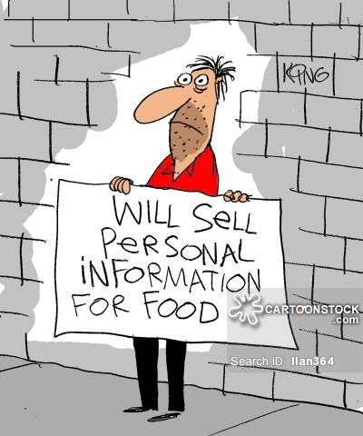

---
output:
  xaringan::moon_reader:
    includes:
      after_body: insert-logo.Rhtml
    lib_dir: libs
    css: [xaringan-themer.css]
    nature:
      highlightStyle: github
      highlightLines: true
      countIncrementalSlides: false
      ratio: "16:9"
    seal: false
---


```{r setup, include=FALSE}
options(htmltools.dir.version = FALSE, crayon.enabled = TRUE, htmltools.preserve.raw = FALSE)

knitr::opts_chunk$set(echo = FALSE, message = FALSE, warning = FALSE)


library(xaringanthemer)
library(crayon)
library(tidyverse)
library(knitr)
library(ggthemes)
library(xts)
library(tidyquant)
library(dygraphs)
library(widgetframe)
library(igraph)
library(networkD3)
library(plotly)
library(ggtext)
library(glue)
library(RColorBrewer)
library(countrycode)
library(cowplot)
library(grid)


```


```{r xaringan-themer}


xaringanthemer::style_mono_light(
  base_color = "#2A363B",
  link_color = "#FF847C",
  text_slide_number_color = "#FECEA8",
  header_font_google = google_font("Lato"),
  text_font_google   = google_font("Roboto"),
  code_font_google   = google_font("IBM Plex Mono"),
  text_font_size = "1.25rem",
  colors = c(
    red = "#f34213",
    purple = "#3e2f5b",
    orange = "#ff8811",
    green = "#99B898",
    white = "#FFFFFF"
  )
)


# colors can be used like this:This ** .red[simple] ** .white.bg - purple[demo]
# _.orange[shows]_ the colors .green[in action].
```


```{r xaringan-tile-view, echo=FALSE}
xaringanExtra::use_tile_view()
```


```{r xaringan-scribble, echo=FALSE}
xaringanExtra::use_scribble(pen_color ="#2A363B")
```


class: inverse, center, middle


# The Politics of Digital Capitalism

## Spring/Summer Term 2021

<br>

### Anke Obendiek & Timo Seidl

### Centre for European Integration Research


---


name: contents-slide

## Overview

.pull-left[


[Session 1: Introduction](#part1)

#### Part I: Digitalization as Commodification

[Session 2:  Surveillance Capitalism](#part2)

[Session 3:  Data Imperatives](#part3)

#### Part II: The Politics of Platform Capitalism

[Session 4: The Business of Platforms](#part4)

[Session 5:  Law & Digital Capitalism](#part5)

[Session 6: Platform Power](#part6)

]


.pull-right[


[Session 7: The Normative Politics of Data Governance](#part7)

[Session 8: Explaining the GDPR](#part8)

[Session 9:  Data Protection Beyond Europe](#part9)


#### Part III: Critical Perspectives

[Session 10: Polanyi and the Platform Economy](#part10)

[Session 11: Not just Breaking but also Making the Law](#part11)

[Session 12: Knowledge and Digital Capitalism](#part12)
   
]

---


name: part1
class: inverse, center, middle

# Session 1: Introduction

.footnote[

[Back to the contents slide](#contents-slide)

]

---

## The Rise of the FANGMA

```{r cache=TRUE}

sp500 <- tq_index("SP500")
stocks_bigtech <- tq_get(x = subset(sp500, symbol %in% c("AAPL", "MSFT", "AMZN", "FB", "GOOG", "GOOGL", "NFLX"))$symbol, get = "stock.prices", from = "2010-01-01")

stocks_bigtech%<>%
  left_join(tq_index("SP500"))%>%#join with this data to get shares held
  mutate(market_cap = (adjusted*shares_held)/10000000000)%>% #calculate market share and divide by billion
  select(date, company, market_cap)%>%
  pivot_wider(names_from = company, values_from = market_cap)%>%
  rowwise() %>% # join different google shares
  mutate(Alphabet= sum(`Alphabet Inc. Class C`, `Alphabet Inc. Class A`))%>%
  ungroup()%>%
  select(-c(`Alphabet Inc. Class C`, `Alphabet Inc. Class A`))%>%
  replace(is.na(.), 0)%>%
  select(date, sort(current_vars()))%>%#sorting variables alphabetially
  mutate(date = as.Date(as.character(date,"%Y-%m-%d")))# change date for xts transform


stocks_bigtech_xts <- xts(x = stocks_bigtech[, -1], order.by = stocks_bigtech$date)

ts <- dygraph(stocks_bigtech_xts, width = 515, height = 475)%>%
    dySeries("Amazon.com Inc.", label = "Amazon", color = "#FF9900") %>%
  dySeries("Apple Inc.", label = "Apple", color = "#A2AAAD") %>%
  dySeries("Facebook Inc. Class A", label = "Facebook", color = "#3b5998")%>%
    dySeries("Alphabet", label = "Google (Alphabet)", color = "#4285F4")%>%
  dySeries("Netflix Inc.", label = "Netflix", color = "#D81F26") %>%
  dySeries("Microsoft Corporation", label = "Microsoft", color = "#7db700") %>%
  dyOptions(stackedGraph = TRUE,
            fillGraph = TRUE, 
            fillAlpha = 0.4) %>%
  dyAxis("y", label = "Market Capitalization ($ Trillion)") %>%
  dyRangeSelector(height = 30)%>%
  dyShading(from = "2010-01-01", to = format(Sys.time(), '%Y-%m-%d'), color = "#E9EAEB")
```


```{r }
frameWidget(ts)
```


---

## How to think about digitalization?

.pull-left[

<br>


> *"Technology is neither good nor bad; nor is it neutral"* &mdash; Kranzberg's First Law of Technology


<br>


> *"Technology might be a prime element in many public issues, nontechnical factors take precedence in technology-policy decisions"* 
&mdash; Kranzberg's Fourth Law of Technology


]


.pull-right[


<br>
<br>

&rArr; Digitalization has a disruptive and a **commodifying** thrust


<br>
<br>
<br>


&rArr; Digitalization is a politically contested and politically shaped process


]


???

- Direction to technological change

- Commodification:
  - new areas of social life are opened for commercial exploitation
  - existing de-commodifying institutions are put under pressure

- Disruption: skills become obsolete, business models become nonviable, competitive advantages disappear

- Digitalization as politically contested

-> Technological Change not just a technological phenomenon, shaped by political decisions

-> How can we understand these political decisions?

---

## Example: The Contested  <br> Commodification of Personal Data

.pull-left[

```{r out.width= '70%'}

```

]


--

.pull-right[


```{r out.width= '100%'}
knitr::include_graphics("GDPR.jpg")
```


]

???

Data as a valuable asset: training data, advertising, product experience, but also behavioral manipulation. 

Deal at the heart of the internet: data in exchange for free stuff. Problem: data hunger lets companies colonize ever more areas of our lives, collecting data which can then be commercialized about all kinds of things (e.g. smart hairbrushes).

This in turn leads to follow-up problems: privacy comes at a price; there is a large information asymmetry; data can be used for manipulative purposes.

**But: ** Also a counter-movement against this commodification: political movements and powerful actors have pushed for greater data protection, trying to rebalance the tradeoffs between the fundamental right to data protection and commercial motives.

But when and how are such regulations adopted, and which explains the shape they take?
---

## About Us & About You

.pull-left[

<br>

Who we are

- We are newly minted post-docs (Universitätsassistent) at the [Centre for European Integration Research (EIF)](https://eif.univie.ac.at/)

- We work on the EU's role and ambitions in the digital transformation

]

.pull-right[

<br>

What about you?

- What's your name?

- What do you study?

- Why did you pick this course?

- If you had to stop using the products of all but one digital giant, which one would you choose?


]


---

## Course Policy

<br>

- *Zoom*: Please don't make us speak to a black wall!

- *Response Papers*: Please upload them until 18:00 two days before the seminar (i.e. on Monday evening)

- *Grading*: For individual assignments, we use a 15 point scale (with 15 being the highest and 0 being the lowest score), which we'll later convert into your grade. 

- *Feedback*: If you want more extensive feedback on any of your assignments, just reach out to us!


---
## Any Questions?

<iframe src="https://pollev-embeds.com/discourses/cgKMtGiscBN4hTwQtxtP9/respond" width="900px" height="500px"></iframe>

---

## Any Questions?

<iframe src="https://embed.polleverywhere.com/discourses/oTsbkrBxEB7AlDQH9lj5u?controls=none&short_poll=true" width="900px" height="500px"></iframe>


---

class: hide-logo

<object data="https://www.timoseidl.com/courses/politics-of-platform-capitalism/Syllabus_The-Politics-of-Digital-Capitalism---Europe-and-Beyond.pdf" type="application/pdf" width="1000px" height="600px">
    <embed src="https://www.timoseidl.com/courses/politics-of-platform-capitalism/Syllabus_The-Politics-of-Digital-Capitalism---Europe-and-Beyond.pdf">
        <p>This browser does not support PDFs. Please download the PDF to view it: <a href="https://www.timoseidl.com/courses/politics-of-platform-capitalism/Syllabus_The-Politics-of-Digital-Capitalism---Europe-and-Beyond.pdf">Download PDF</a>.</p>
    </embed>
</object>
---
name: part2
class: inverse, center, middle

# Session 2: Surveillance capitalism 

---

# Today's readings 

.pull-left[


```{r out.width= "70%", hjust = 2.5}

knitr::include_graphics("https://i.guim.co.uk/img/media/7aa4960f0f1a23dfc432accea08f7b80fc41be7c/0_224_6720_4032/master/6720.jpg?width=620&quality=45&auto=format&fit=max&dpr=2&s=b7e6a18777dbc4b93acc92aee1d74100")

```


<font size="2"> Photograph: David Levene/The Guardian </font>]

.pull-right[


```{r out.width= "70%", hjust = 2.5}

knitr::include_graphics("https://upload.wikimedia.org/wikipedia/commons/e/ee/Wer_kann_die_neue_Zukunft_machen%3F_%2817333061348%29.jpg")

```


<font size="2"> Author: Peter Ostholt - RLS </font>]
---
##Discussion questions 

###In general 
What questions came up when reading the articles / hearing the presentations? 
What would you suggest as main take away points? Did you miss some in the presentations?


Morozov: What would have been the Copernican revolution in Zuboff’s thought? Why has it, however, failed? 

###For further discussion
When thinking about the seminar title: how can we properly describe digital capitalism (considering both Zuboff’s surveillance-capitalism-theory and Morozov’s critique)?

---

##Conceptualizing forms of capitalism 

<br/>


.pull-left[
**•	Managerial capitalism** 

**•	Distributed capitalism / advocacy capitalism**

**•	Surveillance capitalism **
]

.pull-right[
Write down in shared Etherpad: 

**1.	Time of emergence**

**2.	Characteristics **

**3.	Exemplary firm **

**4.	Advantages **

**5.	Criticism**]

---
# Who's right? 
.pull-left[
####Zuboff
>[...] **surveillance capitalism departs from the history** of market capitalism in surprising ways, demanding both unimpeded freedom and total knowledge, **abandoning capitalism’s reciprocities with people and society**, and imposing a **totalizing collectivist vision** of life in the hive, with surveillance capitalists and their data priesthood in charge of oversight and control.

]

.pull-right[
####Morozov 
>To view surveillance capitalism as our new invisible Leviathan is to **miss how power, under capitalism, has been operating for several centuries**: the invisible Leviathan has been with us for quite some time.

]


---


name: part3
class: inverse, center, middle

# Session 3: Data Imperatives

.footnote[

[Back to the contents slide](#contents-slide)

]

---


## Colonization of the Lifeworld <br> by Digital Imperatives


.pull-left[


<font size="4.2"> 

>"In place of "false consciousness" we today have a "fragmented consciousness" that blocks enlightenment by the mechanism of reification. It is only with this that the conditions for a colonization of the lifeworld are met. **When stripped of their ideological veils, the imperatives of autonomous subsystems make their way into the lifeworld from the outside—like colonial masters coming into a tribal society—and force a process of assimilation upon it. The diffused perspectives of the local culture cannot be sufficiently coordinated to permit the play of the metropolis and the world market to be grasped from the periphery**." <br> 	&mdash; Jürgen Habermas, Theory of Communicative Action - Volume 2

]

.pull-right[

```{r out.width="45%", fig.align='center'}
knitr::include_graphics("https://foreignpolicy.com/wp-content/uploads/2021/02/Juergen-Habermas-philosopher-BEELDUNIE_00054019-article.jpg?w=683")
```

]

---

class:inverse, center, middle

# Exercise I

<br>

### What, do you think, have tech companies such easy time collecting data from and about us?


???

Regardless of how literal we take the diagnosis of a colonization of our lives by tech companies, it seems that they do indeed have a rather easy time collecting data about us.


---


class: hide-logo


.pull-left[

## Example: Gamification

<br>
<br>

> "Games are the only force in the known universe that can get people to take actions against their self-interest, in a predictable way, without using force." <br> &mdash; Gabe Zichermann

]

.pull-right[


<br>

```{r fig.align='center', out.width="80%"}

```

]


---

class: hide-logo


.pull-left[

## Compulsive Hoarding?

<br>

> "It does not matter that the amounts collected may vastly exceed a firm’s imaginative reach or analytic grasp. The assumption is that it will eventually be useful, i.e.
valuable." <br>	&mdash; Fourcade & Healy 2017


<br>

#### To what extent does data collection follow from economic versus 'ceremonial' imperatives?


]


.pull-right[


<blockquote class="twitter-tweet"><p lang="en" width="20" dir="ltr" >“We have big data, can you help us?”<br><br>The data: <a href="https://t.co/xqGDMNa2cN">pic.twitter.com/xqGDMNa2cN</a></p>&mdash; TJ Murphy (@teej_m) <a href="https://twitter.com/teej_m/status/1372983145130201089?ref_src=twsrc%5Etfw">March 19, 2021</a></blockquote> <script async src="https://platform.twitter.com/widgets.js" charset="utf-8"> </script>


]

---

## Valuation and Value Extraction


```{r out.width= "85%", fig.align="center"}

#use frameablewidget instead of framewidget (for better embedding and also for pdf printing)

widgetframe::frameableWidget(DiagrammeR::grViz("

digraph{

graph[ rankdir =LR, fontsize = 35]

node[shape = box, fontname = Helvetica, fontcolor = '#2A363B']


'A'[width = 2.8, label=<'Pro-Social' Behavior<BR />
        <FONT POINT-SIZE='10'>(e.g., donating blood or money)</FONT>>]
'B'[width = 2.8, label=<Self-Discipline<BR />
        <FONT POINT-SIZE='10'>(e.g., exercising regularly)</FONT>>]
'C'[width = 2.8,label=<Virtues<BR />
        <FONT POINT-SIZE='10'>(e.g., reliably paying bills)</FONT>>]
'D'[width = 2.8,label='...']
'E'[width = 2.8,label=<'Anti-Social' Behavior<BR />
        <FONT POINT-SIZE='10'>(e.g., spreading rumors, jaywalking)</FONT>>]
'F'[width = 2.8,label=<Selfishness<BR />
        <FONT POINT-SIZE='10'>(e.g., cheating in online games)</FONT>>]
'G'[width = 2.8,label=<Vices<BR />
        <FONT POINT-SIZE='10'>(e.g., buying cigarettes, alcohol'</FONT>>]
'H'[width = 2.8,label='...']


'I'[width = 3.8, label=<Financial Benefits<BR />
        <FONT POINT-SIZE='10'>(e.g., cheaper credit, cheaper insurance)</FONT>>]
'J'[width = 3.8,label=<Reputational Benefits<BR />
        <FONT POINT-SIZE='10'>(e.g., social status)</FONT>>]
'K'[width = 3.8, label=<Professional Benefits<BR />
        <FONT POINT-SIZE='10'>(e.g., faster promotion, access to jobs)</FONT>>]
'L'[width = 3.8,label=<Public Benefits<BR />
        <FONT POINT-SIZE='10'>(e.g., school admission, access to public services)</FONT>>]
'M'[width = 3.8,label='...']

        
'Übercapital'[shape = circle, style = filled, fillcolor = '#FECEA8']


edge[color = '#2A363B']


'A' -> 'Übercapital'[ label = '+', color = 'green', fontcolor = 'green']
'B' -> 'Übercapital'[ label = '+', color = 'green', fontcolor = 'green']
'C' -> 'Übercapital'[ label = '+', color = 'green', fontcolor = 'green']
'D' -> 'Übercapital'[ label = '+', color = 'green', fontcolor = 'green']
'E' -> 'Übercapital'[ label = '-', color = 'red', fontcolor = 'red']
'F' -> 'Übercapital'[ label = '-', color = 'red', fontcolor = 'red']
'G' -> 'Übercapital'[ label = '-', color = 'red', fontcolor = 'red']
'H' -> 'Übercapital'[ label = '-', color = 'red', fontcolor = 'red']


'Übercapital' -> I 
'Übercapital' -> J

'Übercapital' -> K[style = dashed]
'Übercapital' -> L[style = dashed]
'Übercapital' -> M[style = dashed]
}

"))
```


???
Just as the other forms of capital discussed by the French sociologist Pierre Bourdieu, namely, economic capital, social capital (i.e. good connections) and cultural capital (e.g. good manners, education, etc.), übercapital has an input and an output dimension. On the one hand, it is accumulated over an individual´s biography, built up from the countless digital traces left behind on social media and shopping websites, fidelity and fitness programs. On the other hand, übercapital conveys advantages such as better credit ratings or reputational gains that can themselves be reconverted into other forms of capital. 

---

class:inverse, center, middle

# Exercise II

<br>

### Why, do you think, are the advantages and disadvantages of algorithmic forms of ranking (e.g. digitally enhanced credit scores)?


---
