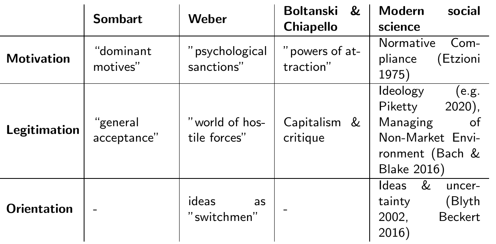
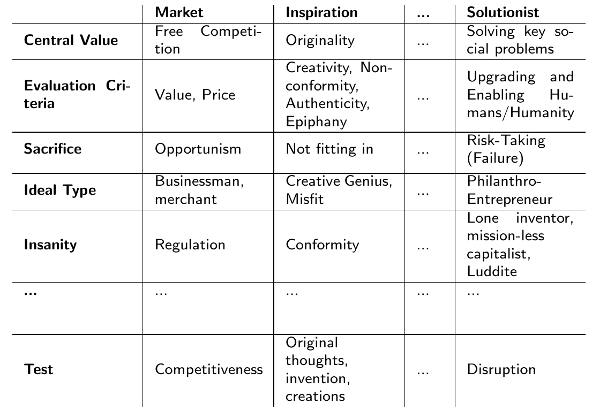

```{r xaringan-themer, include=FALSE, warning=FALSE}
library(xaringanthemer)

style_xaringan(
               header_color = "#000000",
               title_slide_text_color = "#000000",
               title_slide_background_color = "white",
               inverse_background_color = "#000000",
               header_h1_font_size = "3rem",
               text_font_size = "1.25rem",
)
```


```{r setup, include=FALSE}
knitr::opts_chunk$set(echo = FALSE, warning = FALSE, message = FALSE, fig.width = 10.5, fig.height = 7)
options(htmltools.dir.version = TRUE)

if (!require("pacman", warn.conflicts = T))
  install.packages("pacman")

pacman::p_load(
  countrycode,
  DiagrammeR,
  ggthemes,
  RColorBrewer,
  ggrepel,
  tables,
  eurostat,
  networkD3,
  OECD,
  RColorBrewer,
  readxl,
  scales,
  tidyverse,
  webshot,
  readxl,
  patchwork,
  plotly,
  colortools,
  xaringanthemer,
  directlabels,
  kableExtra,
  knitr
)

#path from website

load("only_results.RData")


```

background-image: url("apple_google.jpg")
background-size: contain


> "All of us at Apple and Google believe there has never been a more important moment to work together to solve one of the world’s most pressing problems."

<br>
<br>
<br>
<br>
<br>
<br>
<br>
<br>
<br>
<br>


> "[W]e hope to harness the power of technology to help countries around the world slow the spread of COVID-19 and accelerate the return of everyday life."

???

Three Lessons: 

1) Idea that the world's most important problems can be solved technologically, that all the good things go together, getting rich and making the world a better place, is alive and well. The techlash - the growing skepticism and criticism of tech companies' business models - that until recently had tech companies on the defensive has made way for a renewed confidence of and confidence in tech companies to be a force for good in society.

2) Tech companies are essential players in today's societies and economies that control much of the infrastructures on which these societies and economies run. Without them, it is indeed increasingly difficult to do anything, including health policies.

3) In fact, tech companies are increasingly willing to collaborate with governments in 'solving' large-scale collective problems. This makes sense in light of the fact that if these companies really want to grow, they need to go for the really big markets, two of which are the government and health care. Corona, in that sense, is the ideal opportunity to accelerate the movement of tech companies into these sectors, i.e. digital health and digital public and social policy.

---


## Overview


<br>


- What is solutionism?

- Why the 'spirit of capitalism'?

- How can we measure this?

- What do we find?

- What are the implications?

---

class: inverse, center, middle

#  What is solutionism?

---


## Elements of solutionism

<br>

- Technological solutions to social problems
  
  + Recasting of social problems
  
  + Extrapolation of 'computational thinking'

???


- Evgeny Morozov defines solutionism as an ideology that recasts “all complex social situations either as neatly defined problems with definite, computable solutions or as transparent and self-evident processes that can be easily optimized – if only the right algorithms are in place”
This implies that all relevant social problems can, in principle, be solved technologically; that there is a technological hammer for every social nail.

- “almost aesthetic (. . . ) dislike for inefficiency” (C. Thompson, 2019, p. 21); and a hubristic control illusion that understands social problems in the same way as coding problems by extrapolating from the programmer’s intuition that one “can program any procedure [one] thoroughly understand[s]” (Weizenbaum, 1976, pp. 103–104). Such “computational thinking”  is perfectly epitomized by Mark Zuckerberg’s ‘first principle’ of engineering, which says that one should ‘think of every problem as a system and every system can be better. No matter how good or bad it is, you can make every system better’
--

- Doing well by doing good

  + Not just an inventor, but an innovator
  
  + Belief in the proportionality of profit opportunities and social problems
  


???


- An invention that cannot be commercialized is a lost invention. Larry Page realized this when he was still a boy. Reading a biography of Nicola Tesla, who was a brilliant inventor but a terrible business man, he concluded: “You don’t want to be Tesla. He was one of the greatest inventors, but it’s a sad, sad story. He couldn’t commercialize anything, he could barely fund his own research. You’d want to be more like Edison. If you invent something, that doesn’t necessarily help anybody. You’ve got to actually get it into the world; you’ve got to produce, make money doing it so you can fund it”

- In the solutionist worldview, there is a natural alignment between business opportunities and social problems. ”Want to become a billionaire? Then help a billion people. The world’s biggest problems are the world’s biggest business opportunities” (Diamandis, 2020). 

- Philanthropy is thus neither a separate stage of life nor a more or less profitable side business. Doing good is not an atonement for doing well, but simply the other side of the same coin. ”It’s been a yin and yang equation”, as Tom Werner puts it: ”We’re changing the world on one side and building a great company on the other side” (Hull, 2014).


---


## The solutionist credo: have your cake and eat it too

> ”What’s amazing about tech is that there are so many opportunities to have your cake and eat it, too. There’s a stereotype that you have to choose in life between doing good and making money. I think for a lot of people that’s a real choice. But for technology, there are a significant number of opportunities – Google search being the most massive example of all time – where we simultaneously are doing something lucrative and really good for the world. A lot of times you can get in situations where they’re all aligned, where the bigger the reach of the good you’re doing, the more money you’ll make.” — Justin Rosenstein

???

All elements are present: the assumption that really big problems have a technological solution; the fundamental belief that technology can create win-win situation; that you don't have do choose between becoming rich and doing something good; that you can get rich not before or next to making the world a better place, but precisely by doing so.
---

class: inverse, center, middle

#  Why the 'spirit of capitalism'?

---

## A brief conceptual history


<br>

```{r out.width="100%"}
include_graphics("spirit_books.PNG")
```


***ideational* factors** &nbsp; &rArr; &nbsp; &nbsp; &nbsp; ***normative* ideas** &nbsp;  &rArr; &nbsp; &nbsp; &nbsp; ***dynamic* values**


???

- Spirit of capitalism is a colorful and as Weber himself said "pretentious" concept. We nonetheless chose it because it allows us to conceptualize the role of normative ideas in economic life in a dynamic fashion. Let me elaborate based on the conceptual history of the term:

- Introduced by Sombart: focus on predominant economic attitudes such as acquisitiveness and rationalism -> ideational factors in the economy

- Further developed by Weber: focus not on "mere business astuteness" but on the peculiar ethic; but static concepts: today's capitalism educates and selects its actors through survival of the fittest

- B/C add a dynamic component: focusing on justifications for capitalism change over time in reaction to criticisms and contestation


---


## Definition & Operationalization

<br>

> **Definition:** The spirit of capitalism refers to the historically changing set of normative beliefs that legitimate, motivate, and orient the actions of capitalist actors.

???

Definition distilled from these historical accounts, let's say a bit more about the three central dimension: motivation, legitimation, orientation

---

## Motivation, Legitimation, Orientation


```{r out.width="100%"}

```

???

- Motivation as a central element in all three accounts: for Sombart and Weber: how to we get people with very different economic attitudes to assume capitalist ones? For B/C, how to we get people to not just go to work, but to actually engage there? This is of course also a central theme of modern management discourse, where the questions revolves around how to ensure "normative compliance", that is, how to align the company's goals and values with those of their employees which is often a much better way to ensure good work that monetary sticks and carrots.

- Legitimation central as well: here it is not about how to motivate workers to give their all for companies, but how to justify their legitimacy vis a vis consumers, policymakers, and the public at large. Sombart, in his historical account, is very clear that capitalist ideas of ruth- and relentless growth were not always meet with general acceptance, this acceptance had to be established; Weber was equally clear that the main function of the capitalist spirit was to assert capitalist activities in a world of hostile forces. And for B/C, capitalism is always subject to criticism, and it needs to draw on moral resources external to it, to justify itself. In modern social science, these ideas are discussed in two large literatures: the first is the gigantic literature on ideology, which is concerned with the justification of capitalism as a whole; the second is the literature on the various ways in which firms can manage their non-market environment, not just by CSR, but by a whole lot of ideational strategies that aim at framing and reframing a companies activities in the eyes of public and policymakers.

- Orientation, finally, is a bit more complicated, and it refers to the argument that under conditions of uncertainty, normative ideas can play an independent and not just strategic role even if all actors involved are strictly rational and self-interested. When it is simply unclear what the best investment decisions is, for example, actors will often rely on their beliefs about the world and their role in it to guide their decisions. Weber used the metaphor of ideas as switchmen (Weichensteller) that change the tracks along which action is pushed by the dynamic of interests.

So much for the definition, but how do we operationalize the spirit of capitalism. Here, we need to take one last theoretical step back and look more closely and the theory of B/C.

---


## Orders of Justification


```{r out.width="90%"}

```


???

For B/C, the spirit of capitalism is a mixture of different orders of justification. These orders of justification or polities are something like particular moral grammars that define what is right and valuable. They are, in other words, build around different moral principles, and actors can refer to them to criticize or defend an action. 

According to Boltanski and his co-authors, there are eight such orders of justification, and we argue that solutionism forms a ninth such order. These orders can be defined along several dimensions, such as their central value, how this value is measured or evaluated, what is heroic and what is mad, etc. [Example] This table is part of a larger table, which we extracted from the various writings of Boltanski, Thevenot, Chiapello and others.

---


## Definition & Operationalization

<br>

> **Definition:** The spirit of capitalism refers to the historically changing set of normative beliefs that legitimate, motivate, and orient the actions of capitalist actors.

<br>

> **Operationalization:**	The spirit of capitalism as a compromise between and combination of various orders of justification (or polities). 


???

Like B/C, we understand the spirit of capitalism as a combination of and compromise between such orders of justification. We use this conceptualization to 'measure' the spirit of digital capitalism, and to understand which normative principles are essential for the normative justification and orientation of contemporary capitalism

---

class: inverse, center, middle

#  How can we measure this?

---

## Classifying Text

<br>

**Trade-off** between theoretical and empirical ambition: 

> How can we apply a theoretically ambitious classification to a larger body of text?

???

There is always a trad-off between being able to reliably measure things at scale, and trying to measure things that are not only valid but also theoretically interesting. In other words, it is easy to count words in large numbers of documents in a very reliably way, but this may not be substantively interesting. Conversely, a in-depth qualitative analysis of texts allows a researcher to evaluate even subtle theoretical arguments, but it is very difficult to scale. 


--


<br>

&rArr; Using hand-coded documents to train a classification algorithm which then estimates category proportions in large text corpora (Hopkins & King 2010, Jerzak et al. 2019)

???

What we therefore did is to find something like a middle-ground. We first hand-coded paragraphs into one of the 9 orders of justification described above. We then used this information to train a supervised learning model to estimate category proportions in large text corpora. Let me elaborate... 


---

## Three Text Corpora

<br>

- **Speech Acts by tech elites** &rarr; What are the professed normative beliefs of the elites of digital capitalism?

<br>

- **Wired Magazine** &rarr; What are the dominant normative beliefs in the wider tech milieu?

<br>

- **Harvard Business Review**  &rarr; What are the dominant normative beliefs in capitalist discourse at large?


---

## Three Steps

<br>

- **Hand-code** (Krippendorff’s alpha = 0.7)


<br>


- **Estimate** (Readme2)

<br>


- **Validate** (Trainingsset/Testset-Splits)


???

- This was done based on a coding scheme which was essentially based on the full table of orders of justification. We achieved an inter-coder reliability score of .7, which is not great but decent and perhaps the best we can expect given a coding scheme with our level of complexity. It is also noteworthy that many disagreements were not because coders used different polities but because one chose the "other" category when the second coder chose a polity.
- Most supervised learning techniques are optimized to classify individual documents and follow a parametric ‘classify and count’ logic; readme, by contrast, ‘directly’ estimates the proportion of documents in each category, which has been shown to produce less model dependent and biased results (classifiers can produce biased estimates of proportions even if they correctly classify a high number of documents). readme makes the crucial assumption “that the labeled conditional feature matrix is an unbiased estimator of the unlabeled conditional feature matrix”, that is, that the hand-labelled documents contain word profiles – or examples of language use – sufficiently similar to those in the test set. Given that the hand-labeled documents are a random subset of the unlabeled documents and thus cover the same time (relatively short) period, we are confident to meet this assumption.

- For our analysis, we use the R package readme2 , which improves on the original readme package in two ways: first, it uses pre-trained dictionaries of word vectors to improve the choice of optimal features from a large space of potential document summaries in a way that maximizes textual discrimination between categories; and is uses matching techniques to remove documents from the labeled set that are so different from those in the unlabeled set that they are unlikely to result from the
same data-generating process (which may happen due to semantic change)

- To validate our results, we thus produced 100 random 50/50 splits of the 1203 correctly coded paragraphs and run readme on each of these training set/test set splits. Since we know the ‘true’ proportion of each category in
the test sets, we can compare them to the category proportions estimated by readme.

---

## Validation


```{r}
rm(list = setdiff(
  ls(),
  c("estimates_truth_sum",
    "estimates_truth",
    "readme_elites",
    "output_readme_hbr",
    "output_readme_wired"

  )
))


p <- estimates_truth_sum%>%
  mutate(method = recode(method,  "truevalues" = "True Values"),
         method = factor(method, levels = c("With Matching", "Without Matching", "True Values")))%>%
  ggplot(aes(x = category, y = value, group = method, 
                                     text = paste0(round(value*100, 3), "%"))) +
  geom_point(size = 3, aes(shape = method, color = method)) +
  geom_line(aes(linetype = method, color = method), size = 1.1) +
  scale_y_continuous(labels = scales::percent) +
  scale_color_brewer(palette = "Set1")+
  labs(
    x = "",
    y = "Average Percentage",
    linetype = "",
    color = "",
    shape = ""
  )+
  theme_minimal(base_size = 16)+
  theme(axis.text.x = element_text(angle = 40, hjust = 0.9))

##ggplotly

ggplotly(p, dynamicTicks = TRUE, tooltip = c("text")) %>%
  layout(yaxis = list(tickformat = "%"),
         hovermode = "x",
         legend = list(
      orientation = "h",
      y = -0.5
    )
  )%>%
  config(displayModeBar = F)


```
---

## Validation II

```{r}

estimates_truth_diff <- estimates_truth%>%
  spread(method, value)%>%
  group_by(category, run)%>%
  mutate(diff1 = `With Matching` - truevalues)%>%
  mutate(diff2 = `Without Matching` - truevalues)%>%
  gather(method, value, diff1:diff2)%>%
  ungroup()%>%
  mutate(method = recode(method, diff1 = "With Matching",
                        diff2 = "Without Matching"))


#plot

p2 <- ggplot(estimates_truth_diff, aes(x = category, y = value, group = method, fill = method))+
  geom_boxplot(outlier.size = 0, alpha = 0.25)+
  geom_point(pch = 21, position = position_jitterdodge(), alpha = 0.5)+
  scale_y_continuous(labels = scales::percent, breaks = seq(from = -0.2, to = 0.1, by = 0.025))+
  scale_fill_brewer(palette = "Set1",
                    labels = c("With Matching", "Without Matching"))+
  labs(x = "", y = "Difference between estimate and true value",
       fill = "Method")+
  geom_hline(yintercept = 0, linetype = 1, alpha = 0.7)+
  theme_minimal()+
  theme(legend.position = "top",
    axis.text.x = element_text(angle = 40, hjust = 0.9),
    text = element_text(size = 13))


ggplotly(p2, tooltip = c("")) %>%
  layout(hovermode = "x",
         legend = list(
      orientation = "h",
      y = -0.5
    )
  )%>%
  config(displayModeBar = F)


```


---

class: inverse, center, middle

#  What do we find?


---

## Elite Corpus

```{r}
p3 <- readme_elites%>%
  filter(category != "Other",
         method == "with_matching")%>%
  ggplot(aes(reorder(category, -Percentage), Percentage, group = method, text =  paste0(round(Percentage*100, 2), "%")))+
  geom_bar(aes(), fill = "black", stat="identity", width=.5, position = "dodge")+
  scale_y_continuous(labels = scales::percent)+
  labs(x = "",
       y = "Percentage",
       fill = "") +
  theme_minimal()+
  theme(
    axis.text.x = element_text(angle = 45, hjust = 0.9))


ggplotly(p3, tooltip = c("text")) %>%
  layout(hovermode = "x",
         legend = list(
      orientation = "h",
      y = -0.5
    )
  )%>%
  config(displayModeBar = F)

```

???

- Which are the values digital elites refer to in their speeches and interviews? In other words, what is the normative (self-)image they have or want to project? We find a belief in the world-improving power of technological entrepreneurship is indeed central to the belief system of digital elites, closely followed by the faith in the blessings of the market and the value of efficiency. 

- While this indicates that solutionist ideas are indeed central to how digital elites understand or at least communicate their goals and values, it is fair to ask: why should we care about what digital elites belief or say they belief? At the end of the day, they are still capitalists, and so these beliefs don't matter, even if they are genuine, because all that matters is the legal and economic imperative to seek profits, no matter the cost. The answer to this first question is twofold: first, we actually do believe that these ideas are, for the most part, genuinely held, second, even if they don't they can still be powerful but also costly ways of motivating workers and legitimizing companies. I will come back to this in a second, but let's first look at the extent to which solutionist ideas have spread beyond the narrow circle of tech elites. 


---

## Wired Magazine

```{r}


p4 <- output_readme_wired%>%
  ungroup()%>%
  filter(method == "with_matching")%>%
  filter(category != "Other")%>%
  mutate(year = as.numeric(year))%>%
  ggplot(aes(x = year, y = value, group = category, text =  paste0(round(value*100, 2), "%")))+
  geom_line(aes(linetype = category, color = category))+
  scale_y_continuous(labels = scales::percent)+
  scale_x_continuous(breaks = seq(from = 1985, to = 2020, by = 5))+
  scale_color_brewer(palette = "Set1")+
  labs(x = "",
       y = "Percentage")+
  theme_minimal(base_size = 14)+
  theme(
    axis.text.x = element_text(angle = 90, hjust = 0.9))


ggplotly(p4, tooltip = c("text")) %>%
  layout(hovermode = "x",
         legend = list(
      orientation = "h",
      y = -0.5
    )
  )%>%
  config(displayModeBar = F)

```


???

If we look at the wider tech milieu by looking at wired articles, we find that the solutionist polity is also relevant there, and it seems to have slowly gathered steam over the last decades. It seemed to have grown (and shrunk) as the civic polity grew (and shrunk). We also expected the market and inspiration policy to be prominent in a libertarian, somewhat countercultural magazine like wired, and we see this confirmed. Interestingly, the project polity is largely absent.


---

## Harvard Business Review


```{r}

p5 <- output_readme_hbr%>%
  ungroup()%>%
  filter(method == "with_matching")%>%
  filter(category != "Other")%>%
  mutate(year = as.numeric(year))%>%
  ggplot(aes(x = year, y = value, group = category, text =  paste0( round(value*100, 2), "%")))+
  geom_line(aes(linetype = category, color = category))+
  theme_minimal(base_size = 14)+
  scale_y_continuous(labels = scales::percent)+
  scale_x_continuous(breaks = seq(from = 1985, to = 2020, by = 5))+
  scale_color_brewer(palette = "Set1")+
  labs(x = "",
       y = "Percentage")+
  theme(
    axis.text.x = element_text(angle = 90, hjust = 0.9))


ggplotly(p5, tooltip = c("text")) %>%
  layout(hovermode = "x",
         legend = list(
      orientation = "h",
      y = -0.5
    )
  )%>%
  config(displayModeBar = F)

```

???

This absence of the project policy changes, however, if we look at the harvard business review corpus. Here, we find exactly what we would expect from B/C, namely a strong increase in references since the 1980s, at the expense of the civic polity, which is about the public good and equal rights. Also as we would expect from the central medium of capitalist and manegerial self-reflection, the market and industrial polity are most strongly represented. The solutionist polity, meanwhile, is almost entirely absent, and only recently might have been referred to a bit more often. This suggests that solutionist ideas have not yet made their way from the tech milieu into the heart of capitalist discourse, or are only doing so now. This is similiar to the projective polity, which emerged in the late 1960s but only become hegemonic in the 1980s. 
---

class: inverse, center, middle

#  What about it?

---

## Motivation

<br>

- Capitalism's motivation problem: ensuring compliance with moral carrots 

<br>

- 'Don't be evil' as a boomerang: the self-binding force of normative commitments


<br>

- Between PR and HR: costly signaling in a competitive market for talent


???

- Bewley  writes: “Workers have so many opportunities to take advantage of employers that it is not wise to depend on coercion and financial incentives alone as motivators. Employers want workers to operate autonomously, show initiative, use their imagination, and take on extra tasks not required by management; workers who are scared or dejected do not do these things.” Normative compliance as a powerful tools of aligning worker and company interests, especially for highly complex activities that are difficult to monitor and measure.

- Google's former motto don't be evil is more than a branding ploy. First, we know from numerous inside accounts as well as from our own interviews, that to “a remarkable extent, Google’s workers really do take ‘Don’t Be Evil’ to heart. C-suite meetings have been known to grind to a halt if someone asks, ‘Wait, is this evil?’”. Second, saying that one is not evil is not cheap talk as it gives workers an opening to criticize the company for doing evil things, and for resisting in case their demands are not met. This became very obvious during the recent wave of tech worker resistance. 


- Moreover, tech workers can hold tech companies “hostage to [their] own public image”. And this public image matters if companies want to recruit the best and brightest workers. Tech workers care about the “mission of the company and what the companies are trying to achieve”; “employees”, as one recruiter put it, “are wising up to the fact that you can have a mission statement on your website, but when you’re looking at how the company creates new products or makes decisions, the correlation between the two is not so tightly aligned”. Across elite universities, there is “a growing sentiment that Silicon Valley’s most lucrative positions aren’t worth the ethical quandaries”. Facebook, in particular, had an increasingly difficult time recruiting talent “as the social stigma of working for Facebook began outweighing the financial benefits”


---


## Legitimation


<br>

- Shaping the 'moral background': how moral goodness is assessed (Abend 2014)

<br>

- The techlash that came late: why did tech companies get away with it for so long?


<br>

- Not like Wall Street: how the spirit of digital capitalism reacts to capitalism's new social critics

???

- We argue that the spirit of capitalism amplifies the effectiveness of such legitimacy-seeking strategies by shaping the ‘moral background’ (Abend, 2014) of the public and political debates on capitalism. The moral background “provides the theories and tools that people and organizations employ to ascertain goodness in the realm of morality” (Abend, 2014, p. 30). By drawing on the theories and tools embodied in the current manifestation of the capitalist spirit, capitalists can ‘juice up’ the persuasiveness of their legitimacy-seeking activities and thereby ensure
favorable regulatory and reputational outcomes

- Given their central role in contemporary economies and societies, how could tech companies get away with so little regulatory oversight and political scrutiny for so long ? Our answer is that they were not only very adept in managing their non-market environment, but could also exploit a favorable moral background in which solutionist ideas had already taken hold. In addition, solutionism provided a powerful rationale for limiting regulatory oversight and political scrutiny. Who, after all, is the government to stop tech companies from tackling many of the problems the government itself is no longer able to solve? For a central belief of many tech elites – and often a crucial part of their business model – is the assumption that “lawlessness is the necessary context for ‘technological innovation’”. Larry Page, for example, has argued that “[o]ld institutions like the law and so aren’t keeping up with the rate of change that we’ve caused through technology” and only hamper Google’s ability to “build really great things". The problem is, many believed them.


- Lastly, while the new spirit of capitalism emerged as a reaction to the critique that Fordist capitalism was overly rigid and hierarchical, and incorporated these criticisms within a new ethos of flexibility, the spirit of digital capitalism is more of a critic of the egoistic tendency of today's financial capitalism. At a time when capitalism was increasingly criticized for producing private but not public wealth and for creating rather than solving social problems, solutionism lends legitimacy to those that promised to harness the power of entrepreneurship and technology for the common good – and thereby also to capitalism itself. It was easy, for a company like Uber, for example, to win over regulators by promising to solve ‘grand societal challenges’ such as safety, harassment, or transportation


---

## Orientation


<br>

- In the shadow of uncertainty: if we don't know what to do we might as well do what we think is right

<br>

- A bit of focus: how moral ideas organize economic activities


<br>

- A future brave and bold: selling expectations, not just products


???

- It is a key insight from economic sociology that under economic uncertainty, actors cannot know in advance which investment decision will pay off and which innovations will take off. All they might care about is profits, but they still would not know how to go about it. It is therefore often beliefs – such as heuristics from the past or fictional expectations about the future – that guide the hand of even the most rational and selfish business men. And here, moral ideas about one's role in the world and about what is good and right are at least as good of a heuristic as any.

- This may at times be quite self-serving, as Fred Turner recounts: “About ten years back, I spent a lot of time inside Google. What I saw there was an interesting loop. It started with, ‘Don’t be evil.’ So then the question became, ‘Okay, what’s good?’ Well, information is good. Information empowers people. So providing information is good. Okay, great. Who provides information? Oh, right: Google provides information. So you end up in this loop where what’s good for people is what’s good for Google, and vice versa”. But it is important to see here that the belief that information is good nudged Google to focus on those products – of all possible products – that would put Google in a position to ‘organize the worlds information’. This is was what being good meant, after all, so Google focused its investments in ‘information-organizing’
products such as maps, books, or news, which eventually proved highly profitable.

- Lastly, the grand scale of the projects and ambitions of tech elites is also a powerful way of creating imagined futures to investors and the public, which works like a Siren song that attracts investors even beyond what the hard economic numbers might justify. We might understand this as yet another way in which solutionist beliefs guide investment decisions.


---


## Solutionism in times of corona


<br>

- The techlash wanes: Tech companies seem to be essential *in* the corona crisis and *for* solving it 

<br>

- Data colonialism on steroids: big tech goes public

<br>

- Good cop, bad cop: solutionism and neoliberalism


???

- In the wake of recent events, much of techlash discussion - around the growing scepticism and criticism of tech companies - seems oddly out of place. Is it not Facebook where many of us get in touch with friends, near and far? Are it not Zoom and Skype that allow us to stay in touch with colleagues and remain close to our families? Are it not Google and Twitter that many of us turn to in our search for information? Are it not Amazon and Deliveroo that sustain our quarantined existence? 

At the same time, there seems to be hardly a way around tech companies when it comes to solving the crisis: from the corona app running on Google and Apple smartphones, to Google's and Facebook's geospatial movement data, to Facebook's "Coronavirus Information Center", to test kits and possibly vaccination ordered not just with the speed and convenience of Amazon prime, but actually on Amazon prime.

- Tech companies can and do use this crisis to reclaim their role as the world's greatest do-gooders, and to re- and supercharge their solutionist reputation. But they also go beyond this by acknowledging their critical social infrastructure role - from having information about movement patterns to maintaining the virtual town square by regulating speech and information

Consequently, they more and more move to cooperation with public entities such as in the case of the Covid-19 Mobility Data Network in which facebook cooperates with various organizations to predict outbreaks: a quintessential public task. As Mark Zuckerberg recently put it: "The world has faced pandemics before, but this time we have a new superpower: the ability to gather and share data for good. If we use it responsibly, I’m optimistic that data can help the world respond to this health crisis and get us started on the road to recovery."

This is part of a wider movement in which big tech companies more and more move into what can only be called the provision of public welfare by private means. And this moves is justified on explicitly solutionist grounds, by giving the plausible promise that if we only let these companies do their things, things will get better again. 

In the meantime, what these companies are hoping, of course, is that if things are better again, their ubiquitous and much more thorough 'under-the-skin' presence in our private and public life has also gotten normal. Because all these new welfare projects represent not only a massive increase in corporations’ ability to intervene in the management of social life, but also give them the ability to extract vastly more data. As Joao Magalhaes and Nick Couldry have recently put it: these tech companies "will be not only “social media platforms,” “search engines,” and computer makers, but — alongside governments — the very sustainers of our welfare."

- This, then, also means another shift away from neoliberalism as the dominant capitalist ideology. Corona has exposed the problems of neoliberal capitalism, for example when hospitals are privatized to an extreme. But, as Evgeny Morozov recently put it, neoliberalism is merely capitalism's bad coop; the good cop is solutionism, which instead of scaring people with the gospel of competition inspires them with tales of technological wonders and human progress that come from leaving tech companies to work their magic.

But in doing so, it has also justified the retreat of the state from providing basic social services, or at least made it more acceptable by partly compensating for it. In doing so, solutionism disarms and disables our political imagination, making us believe that the only way to solve the problem's of global capitalism, is by having more capitalism, but this time a capitalism of missionaries, not of mercenaries. And given what is at stake, there is a real temptation to succumb to the solutionist allure: simply put, promises of quick technological fixes sound so much more appealing that the abstract promise of politico-economic reform. And so the real danger of this crisis is that it might "entrench the solutionist toolkit as the default option for addressing all our existential problems – from inequality to climate change." (Morozov). 

But there are also signs of hope: the EU has shown signs of being a truly decommodifying power in the area of data protection, and the recent GAIA-x cloud initiative shows that the political imagination for public solutions to pressing problems has not completely dried out. 


---

class: middle, center


```{r}

```

<br>

# Thank you!


```{r eval=FALSE, include=FALSE}

# to print to pdf

pagedown::chrome_print("Nachtwey_Seidl_Spirit_Slides.html")


#the table that was for simplicity eventually copied from latex

data.frame (
  first_column = c("", "Motivation", "Legitimation", "Orientation"),
  second_column = c("Sombart", "'dominant motives'", "'general acceptance'", "-"),
  third_colummn = c(
    "Weber",
    "'psychological sanctions'",
    "'world of hostile forces'",
    "ideas as 'switchmen'"
  ),
  fourth_column = c(
    "Boltanski & Chiapello",
    "'powers of attraction'",
    "capitalism & critique",
    "-"
  ),
  fifth_column = c(
    "Modern Social Science",
    "Normative Compliance (Etzioni 1975)",
    "Managing of Non-Market Environment (Bach & Blake 2016)",
    "Ideas & uncertainty (Blyth 2002, Beckert 2016)"
  )
)%>%
  kable("html", col.names = NULL)%>%
  kable_styling( bootstrap_options = c( "hover", "condensed", "responsive"), full_width = F)%>%
  column_spec(1, bold = T)%>%
  row_spec(1, bold = T)%>%
  row_spec(2,  background = "white")%>%
  row_spec(4,  background = "white")


  
    
    
```

